# 节目服务

## 高性能节目详情展示功能

```java
@Operation(summary  = "查询详情(根据id)")
@PostMapping(value = "/detail")
public ApiResponse<ProgramVo> getDetail(@Valid @RequestBody ProgramGetDto programGetDto) {
    return ApiResponse.ok(programService.detail(programGetDto));
}

@Operation(summary  = "查询详情V1(根据id)")
@PostMapping(value = "/detail/v1")
public ApiResponse<ProgramVo> getDetailV1(@Valid @RequestBody ProgramGetDto programGetDto) {
    return ApiResponse.ok(programService.detailV1(programGetDto));
}

@Operation(summary  = "查询详情V2(根据id)")
@PostMapping(value = "/detail/v2")
public ApiResponse<ProgramVo> getDetailV2(@Valid @RequestBody ProgramGetDto programGetDto) {
    return ApiResponse.ok(programService.detailV2(programGetDto));
}
```

### 接口执行流程

**1. Controller层入口**

```java
@Operation(summary  = "查询详情V2(根据id)")
@PostMapping(value = "/detail/v2")
public ApiResponse<ProgramVo> getDetailV2(@Valid @RequestBody ProgramGetDto programGetDto) {
    return ApiResponse.ok(programService.detailV2(programGetDto));
}
```

**2. Service层处理流程**

从代码分析，`detailV2`方法的执行流程如下：

**步骤1：获取节目演出时间信息**

```java
ProgramShowTime programShowTime =
        programShowTimeService.selectProgramShowTimeByProgramIdMultipleCache(programGetDto.getId());
```


这个方法采用了三级缓存策略：

1. 首先查询本地缓存[LocalCacheProgramShowTime](file:///Users/aer/IdeaProjects/damai/damai-server/damai-program-service/src/main/java/com/damai/service/cache/local/LocalCacheProgramShowTime.java#L32-L75)
2. 本地缓存未命中则查询Redis缓存
3. Redis缓存未命中则通过分布式锁查询数据库并写入缓存 ==分布式锁是为了缓解高并发数据库压力==

**步骤2：获取节目基本信息**

```java
ProgramVo programVo = programService.getByIdMultipleCache(programGetDto.getId(),programShowTime.getShowTime());
```


同样采用三级缓存策略：

1. 首先查询本地缓存[LocalCacheProgram](file:///Users/aer/IdeaProjects/damai/damai-server/damai-program-service/src/main/java/com/damai/service/cache/local/LocalCacheProgram.java#L31-L75)
2. 本地缓存未命中则查询Redis缓存
3. Redis缓存未命中则通过分布式锁查询数据库并写入缓存

**步骤3：设置演出时间信息**

```java
programVo.setShowTime(programShowTime.getShowTime());
programVo.setShowDayTime(programShowTime.getShowDayTime());
programVo.setShowWeekTime(programShowTime.getShowWeekTime());
```

**步骤4：获取节目分组信息**

```java
ProgramGroupVo programGroupVo = programService.getProgramGroupMultipleCache(programVo.getProgramGroupId());
programVo.setProgramGroupVo(programGroupVo);
```


同样采用三级缓存策略：

1. 首先查询本地缓存[LocalCacheProgramGroup](file:///Users/aer/IdeaProjects/damai/damai-server/damai-program-service/src/main/java/com/damai/service/cache/local/LocalCacheProgramGroup.java#L31-L72)
2. 本地缓存未命中则查询Redis缓存
3. Redis缓存未命中则通过分布式锁查询数据库并写入缓存

**步骤5：预加载相关数据**

```java
preloadTicketUserList(programVo.getHighHeat());
preloadAccountOrderCount(programVo.getId());
```


这两个方法会根据条件异步预加载购票人列表和账户订单计数，提升用户体验。

**步骤6：获取节目分类信息**

```java
ProgramCategory programCategory = getProgramCategoryMultipleCache(programVo.getProgramCategoryId());
if (Objects.nonNull(programCategory)) {
    programVo.setProgramCategoryName(programCategory.getName());
}
ProgramCategory parentProgramCategory = getProgramCategoryMultipleCache(programVo.getParentProgramCategoryId());
if (Objects.nonNull(parentProgramCategory)) {
    programVo.setParentProgramCategoryName(parentProgramCategory.getName());
}
```

**步骤7：获取票档信息**

```java
List<TicketCategoryVo> ticketCategoryVoList = ticketCategoryService
        .selectTicketCategoryListByProgramIdMultipleCache(programVo.getId(),programShowTime.getShowTime());
programVo.setTicketCategoryVoList(ticketCategoryVoList);
```

------


### 缓存策略总结

整个流程采用了多级缓存架构：

1. **本地缓存（Caffeine）**：提供最快的访问速度，减轻Redis压力
2. **Redis缓存**：提供分布式缓存能力，确保多实例间数据一致性
3. **数据库**：作为最终数据来源，当缓存都未命中时查询

这种多级缓存策略可以显著提升系统性能，特别是在高并发场景下，能够有效减少数据库访问压力。

**首先添加分布式锁，锁的类型为读锁，写锁是在节目添加接口。使用读写锁可以减少锁的竞争。当其他用户进行查看节目详情时，都是读锁，读锁和读锁之间不会引起锁的竞争**

**获取详情时候加读锁，添加节目时候加的写锁，**
**下面的RLock是缓存重建加锁的**

------

### 懒汉式单例

#### 懒汉式单例模式中的双重检查锁

```java
public class Singleton {
    private static volatile Singleton instance;
    
    public static Singleton getInstance() {
        // 第一次检查，避免不必要的同步
        if (instance == null) {
            synchronized (Singleton.class) {
                // 第二次检查，确保只创建一个实例
                if (instance == null) {
                    instance = new Singleton();
                }
            }
        }
        return instance;
    }
}
```


#### 在代码中的应用

在您提到的代码中，双重检查锁的思想体现在：

1. **第一次检查**：检查Redis缓存中是否存在数据

```java
ProgramVo programVo = redisCache.get(RedisKeyBuild.createRedisKey(RedisKeyManage.PROGRAM, programId), ProgramVo.class);
if (Objects.nonNull(programVo)) {
    return programVo;  // 缓存命中，直接返回
}
```


2. **获取锁**：如果缓存未命中，则获取分布式锁

```java
RLock lock = serviceLockTool.getLock(LockType.Reentrant, GET_PROGRAM_LOCK, new String[]{String.valueOf(programId)});
lock.lock();
```


3. **第二次检查**：获取锁后再检查一次缓存

```java
try {
    // 再次检查缓存，防止其他线程已经重建了缓存
    return redisCache.get(RedisKeyBuild.createRedisKey(RedisKeyManage.PROGRAM,programId)
            ,ProgramVo.class,
            () -> createProgramVo(programId)
            ,expireTime,
            timeUnit);
}finally {
    lock.unlock();
}
```

#### 与单例模式的相似性

这种模式与懒汉式单例的双重检查锁非常相似：

- 都是先检查条件（缓存是否存在/实例是否已创建）
- 都是在条件不满足时获取锁
- 都是在获取锁后再次检查条件
- 都是为了避免不必要的同步开销

这种设计思想在高并发系统中非常常见，是一种很好的性能优化手段。

------

### 防止大量缓存同时失效问题

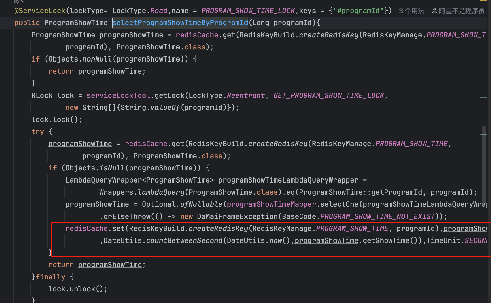

将节目演出时间与当前时间相隔时间作为缓存过期时间

------

### 为什么将节目多个部分分开存储到Redis

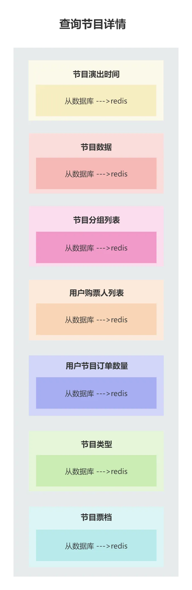

1. **数据更新频率不同**
   - 节目基本信息（如标题、演员等）很少变化，可以长时间缓存
   - 票档信息和座位信息可能频繁更新（如余票数量），需要更短的缓存时间或独立更新
   - 演出时间等信息可能需要根据实时情况调整

2. **数据一致性要求不同**
   - 核心节目信息相对稳定，即使缓存稍有延迟也问题不大
   - 票档余票信息需要相对实时，需要独立管理和更新策略
   - 分开存储可以针对不同数据制定不同的缓存失效策略

3. **性能优化考虑**
   - 当只需要获取节目基本信息时，不需要加载完整的票档信息，减少网络传输和内存占用
   - 对于高并发场景，可以只更新需要变化的部分，而不是整个对象
   - 减少Redis中序列化/反序列化的数据量，提高响应速度

4. **缓存命中率优化**
   - 基础节目信息访问频率远高于票档信息
   - 分离存储可以提高基础信息的缓存命中率，因为不需要因为票档信息的变更而清除整个节目对象缓存

5. **系统解耦**
   - 不同服务可能只需要节目信息的不同部分
   - 分离存储有助于服务间的解耦，每个服务只需关注自己需要的部分

在[ProgramService.getDetail](file:///Users/aer/IdeaProjects/damai/damai-server/damai-program-service/src/main/java/com/damai/service/ProgramService.java#L443-L472)方法中，我们可以看到：

- 首先通过`programService.getById`获取节目基本信息
- 然后单独获取节目演出时间信息
- 接着独立获取节目分组信息
- 再单独获取节目分类信息
- 最后获取票档信息列表

这种设计使得每种数据都可以有不同的缓存策略和更新机制，提高了系统的灵活性和性能。

------

### 锁优化

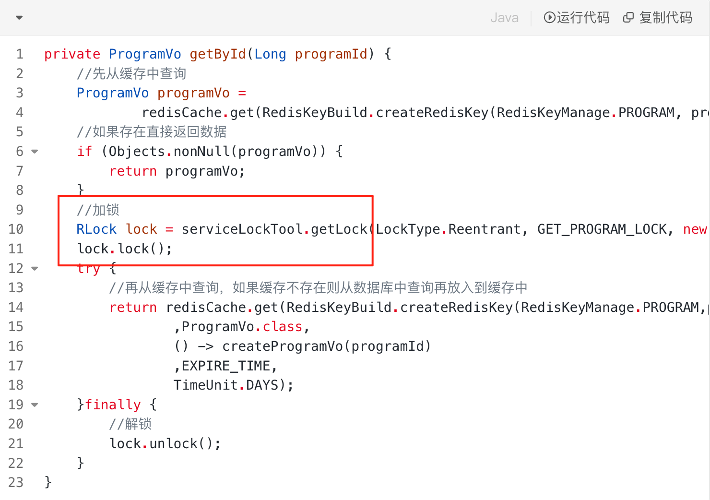

现在除了第一次请求外，其余的请求确实是能从缓存中获得了，但所有的请求还是要挨个去竞争锁的，每个请求依旧还是有获取锁，加锁以及再解锁的过程，还是要挨个的串行处理请求的，依旧不能实现并发的处理

**假设查看同一个节目的并发请求有100w，假设Redis处理锁的请求执行1毫秒就完成，那么等到最后一个请求，还是要等待999999毫秒，约等于16分钟左右**

改为trylock，1s后得不到锁直接走下面流程

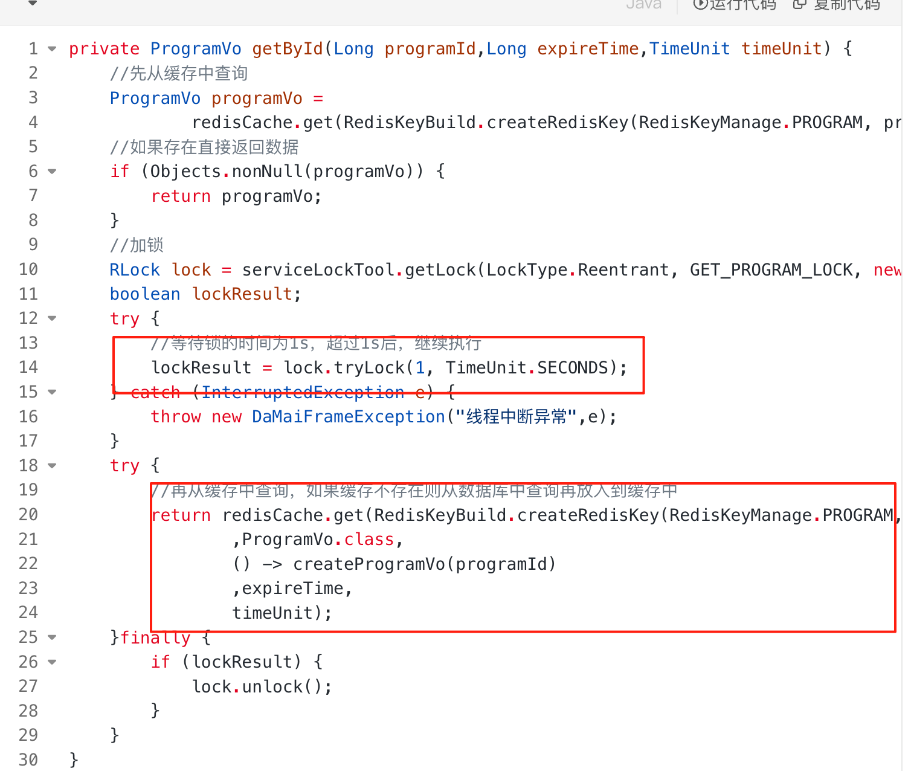

**存在一个问题：如果发生网络问题，一秒内没将数据存到redis中，还是会有大量数据打入数据库导致缓存击穿，但高并发与绝对安全不可兼得，要作出取舍**


------

## 用户选择节目座位

### Redis缓存结构

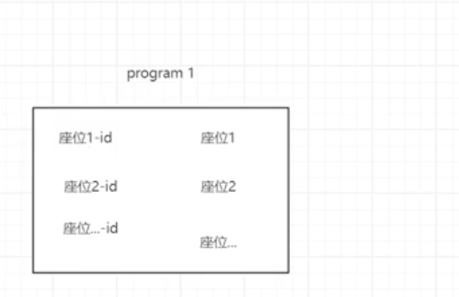

如果采用上面这种Hash结构，由于redis是单线程模型，同一节目下如果不同用户抢不同票档的票会发生竞争关系，比如两个用户分别同时抢看台和内场的票，就会发生内场用户需要等待看台用户抢完或者反之 集群下也会如此

**一个 Hash 存所有票档** → 设计本身没问题，语义清晰、管理方便。

**问题只会在高并发场景下出现** → 因为所有操作都集中在同一个 Key 上：

1. Redis 是单线程 → 一个 Key 的操作只能排队执行。
2. Redis Cluster 分片是 **按 Key 粒度** → 一个 Key 必须落在一个槽位上，不能拆到多个分片。
3. 所以这个热点 Key 会成为性能瓶颈，吞吐量打不满整个集群。

**优化后**

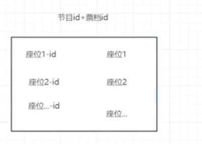

1. 解决不同票档竞争关系
2. 票数压力 如果key只用节目id，几万张票存入一个hash需要过滤出一个票档的 压力很大

**再优化**

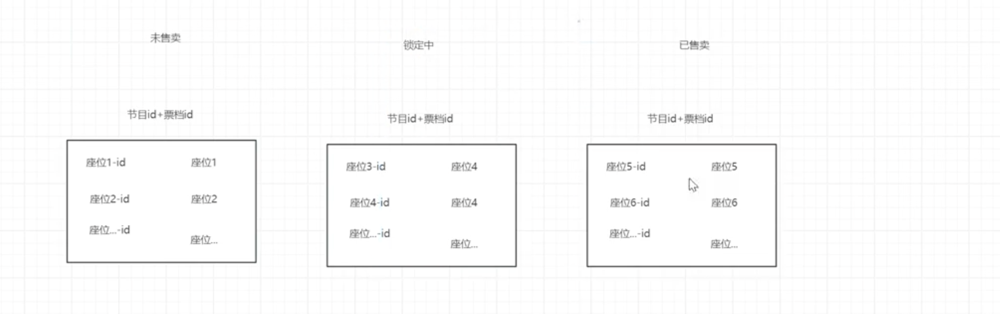

根据票的状态进行分开存放，==但还是在一个redis实例中(保证lua脚本读)==

```java
 public List<SeatVo> getSeatVoListByCacheResolution(Long programId,Long ticketCategoryId){
        List<String> keys = new ArrayList<>(4);
        keys.add(RedisKeyBuild.createRedisKey(RedisKeyManage.PROGRAM_SEAT_NO_SOLD_RESOLUTION_HASH,
                programId, ticketCategoryId).getRelKey());
        keys.add(RedisKeyBuild.createRedisKey(RedisKeyManage.PROGRAM_SEAT_LOCK_RESOLUTION_HASH,
                programId, ticketCategoryId).getRelKey());
        keys.add(RedisKeyBuild.createRedisKey(RedisKeyManage.PROGRAM_SEAT_SOLD_RESOLUTION_HASH,
                programId, ticketCategoryId).getRelKey());
        return programSeatCacheData.getData(keys, new String[]{});
    }
```

------

## 解决高并发下购票压力 

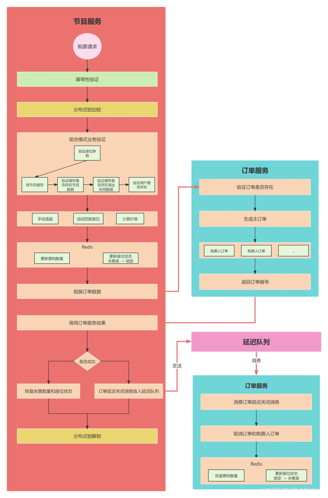

------

### 购票前组合验证

用户购票验证逻辑的类型为`program_order_create_check`，验证的逻辑有

-  验证参数 包含用户id是否唯一、按照是否手动选座进行校验参数是否非空 

```java
  @Override
    protected void execute(final ProgramOrderCreateDto programOrderCreateDto) {
        List<SeatDto> seatDtoList = programOrderCreateDto.getSeatDtoList();
        List<Long> ticketUserIdList = programOrderCreateDto.getTicketUserIdList();
        Map<Long, List<Long>> ticketUserIdMap = 
                ticketUserIdList.stream().collect(Collectors.groupingBy(ticketUserId -> ticketUserId));
        for (List<Long> value : ticketUserIdMap.values()) {
            if (value.size() > 1) {
                throw new DaMaiFrameException(BaseCode.TICKET_USER_ID_REPEAT);
            }
        }
        if (CollectionUtil.isNotEmpty(seatDtoList)) {
            if (seatDtoList.size() != programOrderCreateDto.getTicketUserIdList().size()) {
                throw new DaMaiFrameException(BaseCode.TICKET_USER_COUNT_UNEQUAL_SEAT_COUNT);
            }
            for (SeatDto seatDto : seatDtoList) {
                if (Objects.isNull(seatDto.getId())) {
                    throw new DaMaiFrameException(BaseCode.SEAT_ID_EMPTY);
                }
                if (Objects.isNull(seatDto.getTicketCategoryId())) {
                    throw new DaMaiFrameException(BaseCode.SEAT_TICKET_CATEGORY_ID_EMPTY);
                }
                if (Objects.isNull(seatDto.getRowCode())) {
                    throw new DaMaiFrameException(BaseCode.SEAT_ROW_CODE_EMPTY);
                }
                if (Objects.isNull(seatDto.getColCode())) {
                    throw new DaMaiFrameException(BaseCode.SEAT_COL_CODE_EMPTY);
                }
                if (Objects.isNull(seatDto.getPrice())) {
                    throw new DaMaiFrameException(BaseCode.SEAT_PRICE_EMPTY);
                }
            }
        }else {
            if (Objects.isNull(programOrderCreateDto.getTicketCategoryId())) {
                throw new DaMaiFrameException(BaseCode.TICKET_CATEGORY_NOT_EXIST);
            }
            if (Objects.isNull(programOrderCreateDto.getTicketCount())) {
                throw new DaMaiFrameException(BaseCode.TICKET_COUNT_NOT_EXIST);
            }
            if (programOrderCreateDto.getTicketCount() <= 0) {
                throw new DaMaiFrameException(BaseCode.TICKET_COUNT_ERROR);
            }
        }
    }
```

- 校验是否可以选座以及购票数量是否上限

```java
 @Override
    protected void execute(final ProgramOrderCreateDto programOrderCreateDto) {
        ProgramGetDto programGetDto = new ProgramGetDto();
        programGetDto.setId(programOrderCreateDto.getProgramId());
        ProgramVo programVo = programService.detailV2(programGetDto);
        if (programVo.getPermitChooseSeat().equals(BusinessStatus.NO.getCode())) {
            if (Objects.nonNull(programOrderCreateDto.getSeatDtoList())) {
                throw new DaMaiFrameException(BaseCode.PROGRAM_NOT_ALLOW_CHOOSE_SEAT);
            }
        }
        Integer seatCount = Optional.ofNullable(programOrderCreateDto.getSeatDtoList()).map(List::size).orElse(0);
        Integer ticketCount = Optional.ofNullable(programOrderCreateDto.getTicketCount()).orElse(0);
        if (seatCount > programVo.getPerOrderLimitPurchaseCount() || ticketCount > programVo.getPerOrderLimitPurchaseCount()) {
            throw new DaMaiFrameException(BaseCode.PER_ORDER_PURCHASE_COUNT_OVER_LIMIT);
        }
    }
```

-  验证用户是否存在 检查已购票数+购票数是否超出上限 

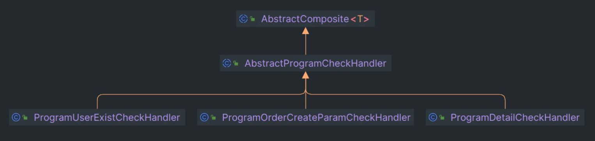

------

### 基本流程

1. 执行组合验证

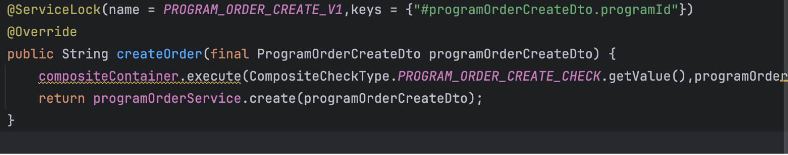

2. 查询演出时间
3. 根据传入的票档id进行查询票档信息
4. 根据对应票档查询未售卖座位


5. 查询余票数量

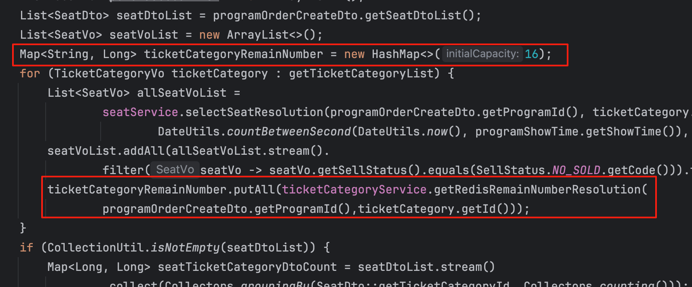

6. 判断每个票档的购买票数是否大于余票

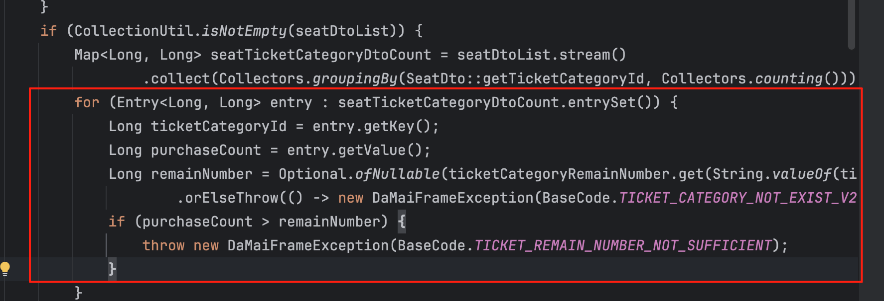

7. 判断前端传入价格是否和真实价格对应的上

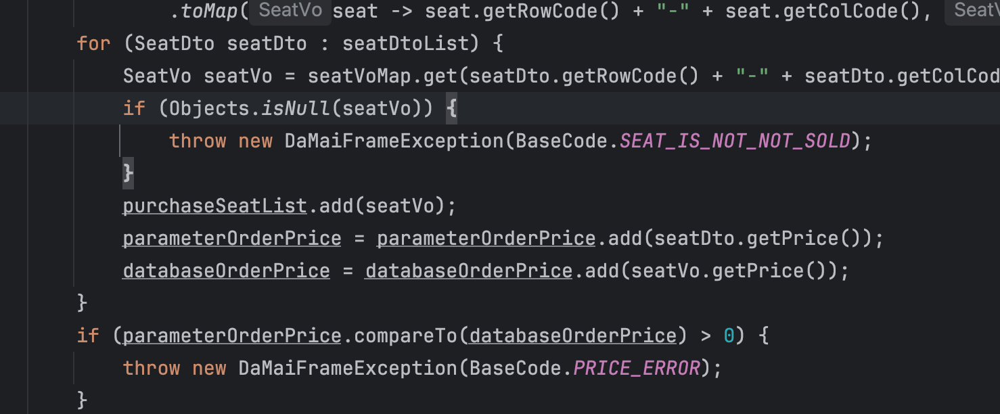

8. 进行扣减库存、更改座位状态 通过lua脚本

```lua
-- 解析传入的参数，将JSON字符串转换为Lua表
-- ARGV[1]: 票档余票数量更新列表
-- ARGV[2]: 需要删除的座位列表
-- ARGV[3]: 需要添加的座位数据列表
local ticket_category_list = cjson.decode(ARGV[1])
local del_seat_list = cjson.decode(ARGV[2])
local add_seat_data_list = cjson.decode(ARGV[3])

-- 遍历票档列表，更新每个票档的余票数量
for index,increase_data in ipairs(ticket_category_list) do
    -- 获取余票数量hash键
    local program_ticket_remain_number_hash_key = increase_data.programTicketRemainNumberHashKey
    -- 获取票档ID
    local ticket_category_id = increase_data.ticketCategoryId
    -- 获取需要增加的票数（可以为负数表示减少）
    local increase_count = increase_data.count
    -- 原子性地增加或减少余票数量
    redis.call('HINCRBY',program_ticket_remain_number_hash_key,ticket_category_id,increase_count)
end

-- 遍历需要删除的座位列表，从Redis中删除座位数据
for index, seat in pairs(del_seat_list) do
    -- 获取座位hash键（需要从中删除座位）
    local seat_hash_key_del = seat.seatHashKeyDel
    -- 获取需要删除的座位ID列表
    local seat_id_list = seat.seatIdList
    -- 从hash中删除指定的座位
    redis.call('HDEL',seat_hash_key_del,unpack(seat_id_list))
end

-- 遍历需要添加的座位数据列表，向Redis中添加座位数据
for index, seat in pairs(add_seat_data_list) do
    -- 获取座位hash键（需要向其中添加座位）
    local seat_hash_key_add = seat.seatHashKeyAdd
    -- 获取座位数据列表
    local seat_data_list = seat.seatDataList
    -- 将座位数据批量设置到hash中
    redis.call('HMSET',seat_hash_key_add,unpack(seat_data_list))
end
```

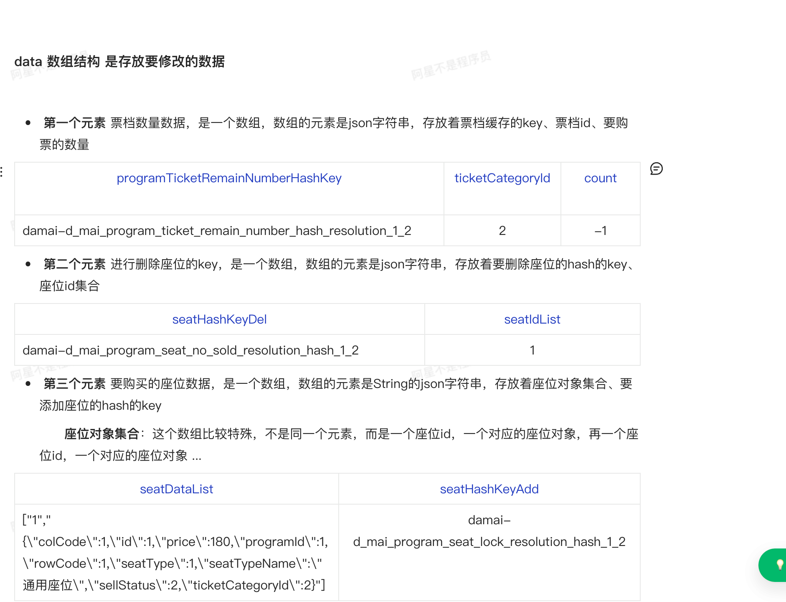


感觉可以将票档余票数量结构改成==redis中key只包含节目id hash中存不同票档的余票数量==

9. 创建主订单和购票人订单(order&order_ticket_user)

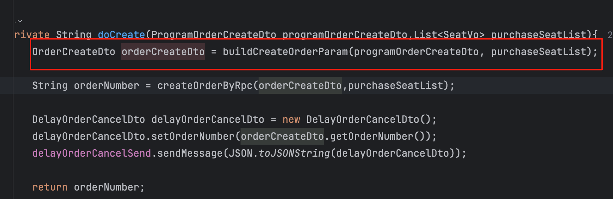

10. 远程调用rpc创建订单


11. 如果订单生成失败 调用之前扣减库存的方法进行回滚

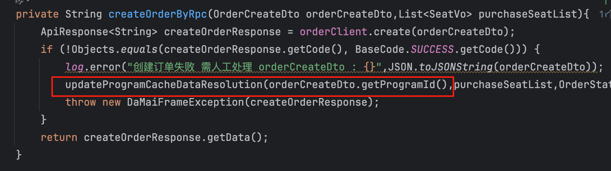

12. 发送延迟消息队列取消订单

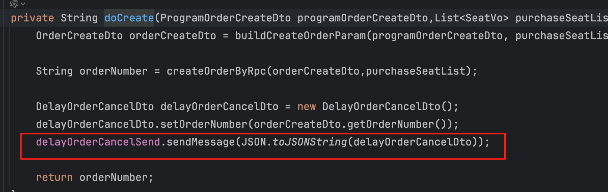

13. 恢复缓存余票和座位状态

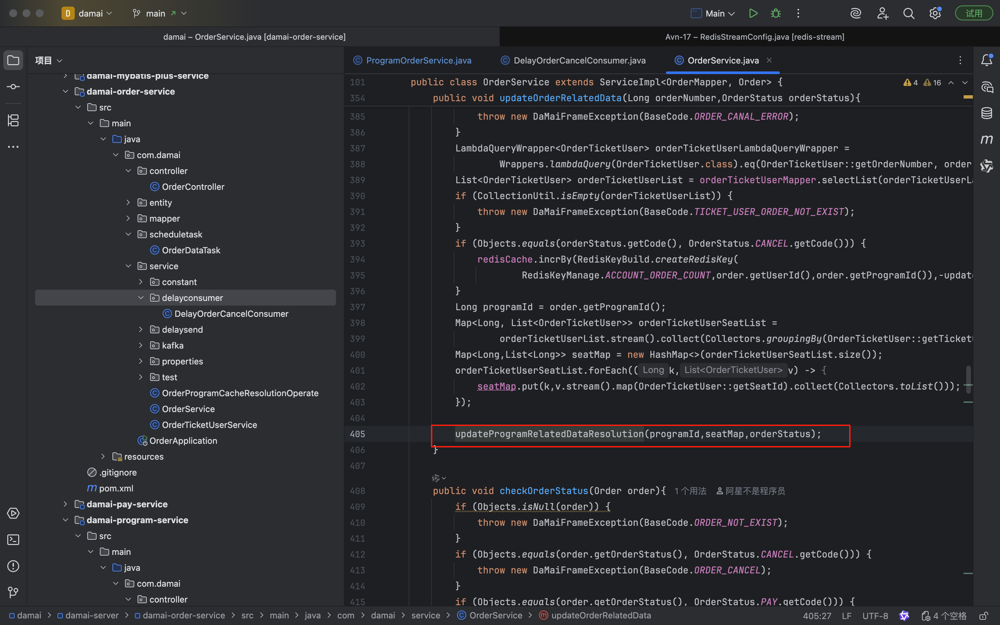

------

### 锁优化  V2

- key：节目+票档id 使得可以多redis实例并发
- 加入本地锁 缓解redis压力
- 由于网络可能有差异 先进入本地锁的不一定先竞争到分布式锁

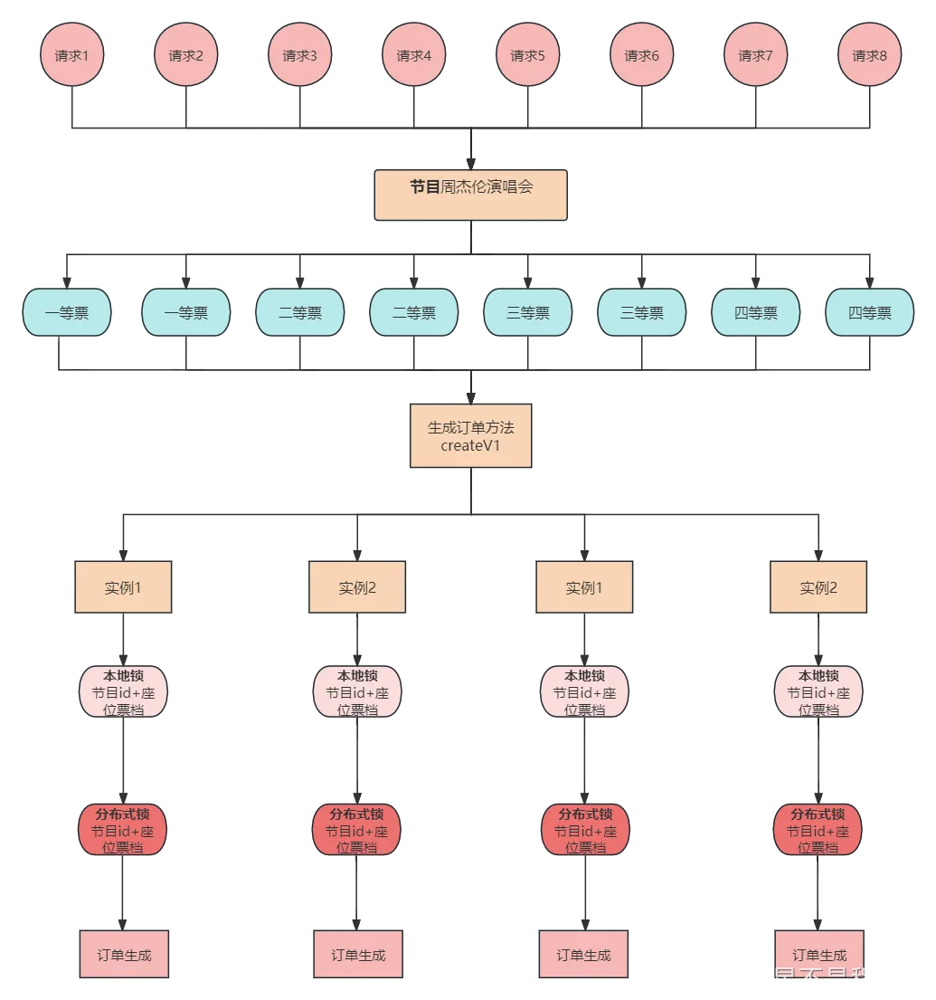


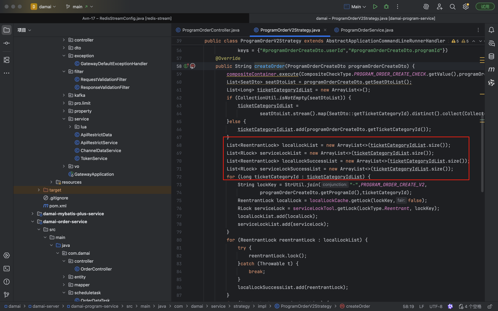

------

### 无锁化 V3

前面做的事情主要是==三重验证==、加==幂等锁==给==不同票档加本地锁==、==计算不同票档所需票==、给lua脚本中key加标识看是否为手动选座，==手动选座则传入dto中的选座信息==

Lua脚本执行流程图

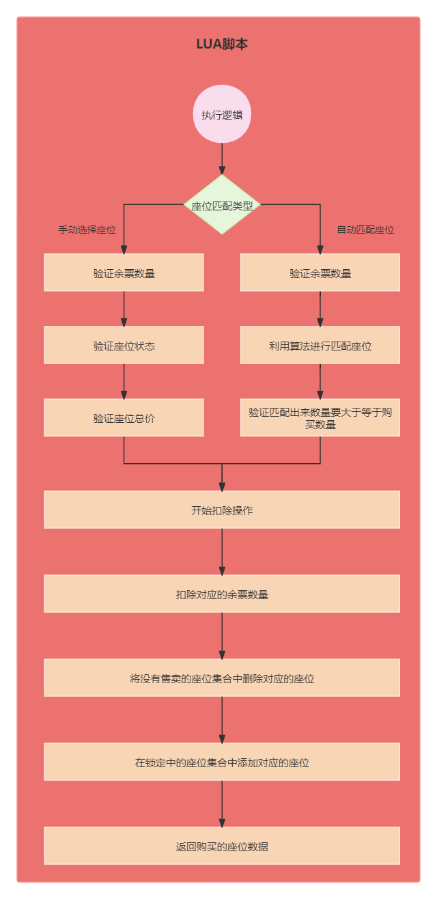

------

### 调用Kafka异步创建订单 V4

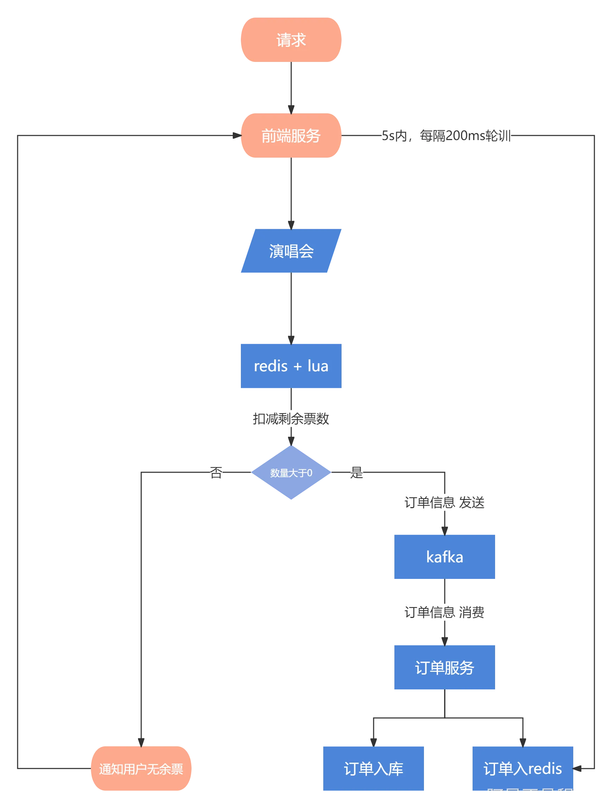

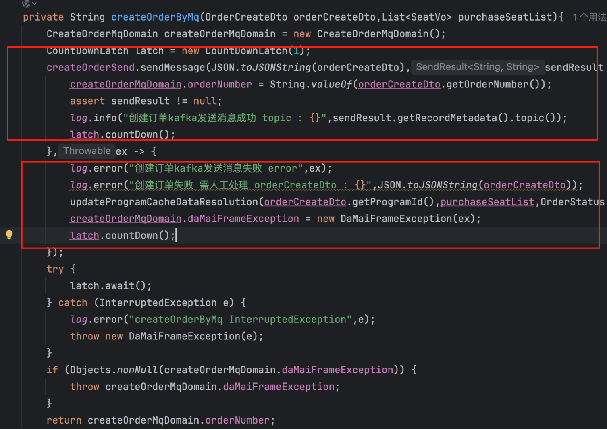

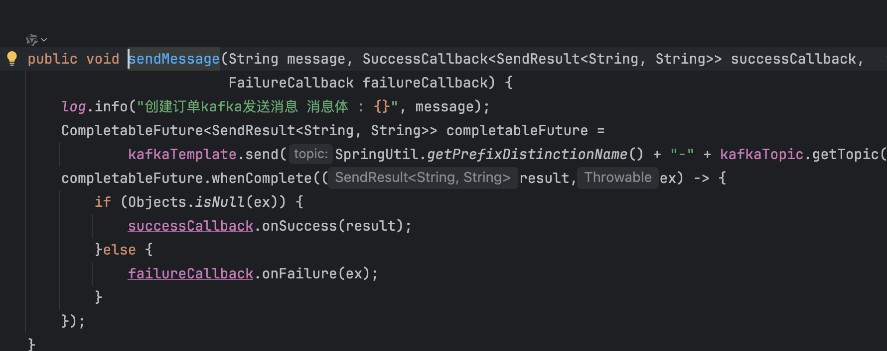

==lathch的作用是等待kafka发送消息完毕==

**消费者**

```java
@Slf4j
@AllArgsConstructor
@Component
public class CreateOrderConsumer {
    
    @Autowired
    private OrderService orderService;
    
    public static Long MESSAGE_DELAY_TIME = 5000L;
    
    @KafkaListener(topics = {SPRING_INJECT_PREFIX_DISTINCTION_NAME+"-"+"${spring.kafka.topic:create_order}"})
    public void consumerOrderMessage(ConsumerRecord<String,String> consumerRecord){
        try {
            Optional.ofNullable(consumerRecord.value()).map(String::valueOf).ifPresent(value -> {
                
                OrderCreateDto orderCreateDto = JSON.parseObject(value, OrderCreateDto.class);
                
                long createOrderTimeTimestamp = orderCreateDto.getCreateOrderTime().getTime();
                
                long currentTimeTimestamp = System.currentTimeMillis();
                
                long delayTime = currentTimeTimestamp - createOrderTimeTimestamp;
                
                log.info("消费到kafka的创建订单消息 消息体: {} 延迟时间 : {} 毫秒",value,delayTime);
                //如果消费到消息时，延迟时间超过了5s，那么此订单丢弃，将库存回滚回去
                if (currentTimeTimestamp - createOrderTimeTimestamp > MESSAGE_DELAY_TIME) {
                    log.info("消费到kafka的创建订单消息延迟时间大于了 {} 毫秒 此订单消息被丢弃 订单号 : {}",
                            delayTime,orderCreateDto.getOrderNumber());
                    Map<Long, List<OrderTicketUserCreateDto>> orderTicketUserSeatList =
                            orderCreateDto.getOrderTicketUserCreateDtoList().stream().collect(Collectors.groupingBy(OrderTicketUserCreateDto::getTicketCategoryId));
                    Map<Long,List<Long>> seatMap = new HashMap<>(orderTicketUserSeatList.size());
                    orderTicketUserSeatList.forEach((k,v) -> {
                        seatMap.put(k,v.stream().map(OrderTicketUserCreateDto::getSeatId).collect(Collectors.toList()));
                    });
                    //数据恢复
                    orderService.updateProgramRelatedDataMq(orderCreateDto.getProgramId(),seatMap, OrderStatus.CANCEL);
                }else {
                    String orderNumber = orderService.createMq(orderCreateDto);
                    log.info("消费到kafka的创建订单消息 创建订单成功 订单号 : {}",orderNumber);
                }
            });
        }catch (Exception e) {
            log.error("处理消费到kafka的创建订单消息失败 error",e);
        }
    }
}
```

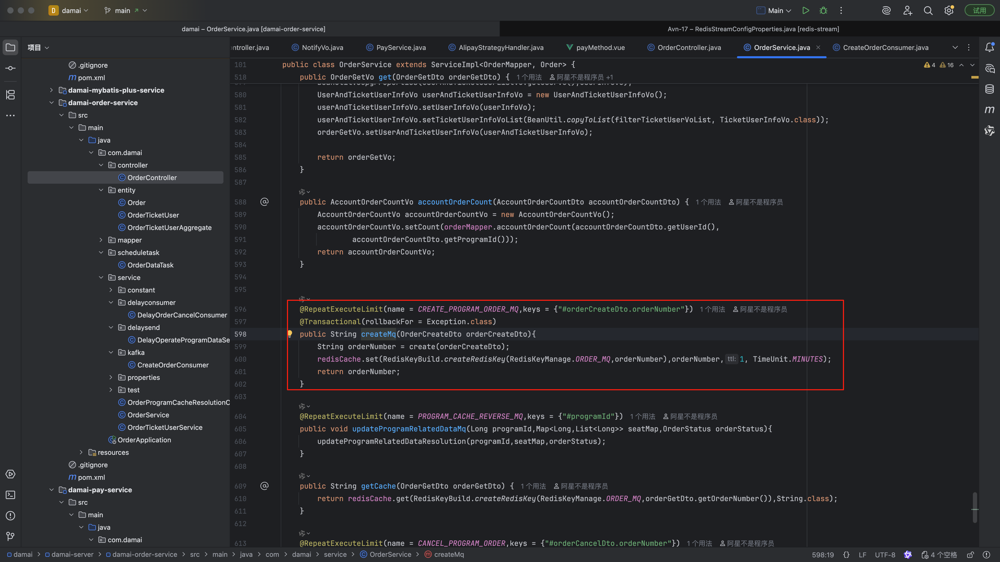

这里将订单编号放入redis是为了==虽然第2步返回了订单编号，但由于异步场景，不一定真正的入库了，所以前端要有个定时任务，不断的去轮训订单是否真的存在，如果查询到了，才说明订单是真正的创建成功==
前端服务在轮训时，能更快的查询到。因为redis的性能要比数据库强太多，所以让前端服务直接去redis查询就可以了，数据也不用复杂，订单编号就可以。但是不能一直存放，要设置一个过期时间，这里设置了1分钟

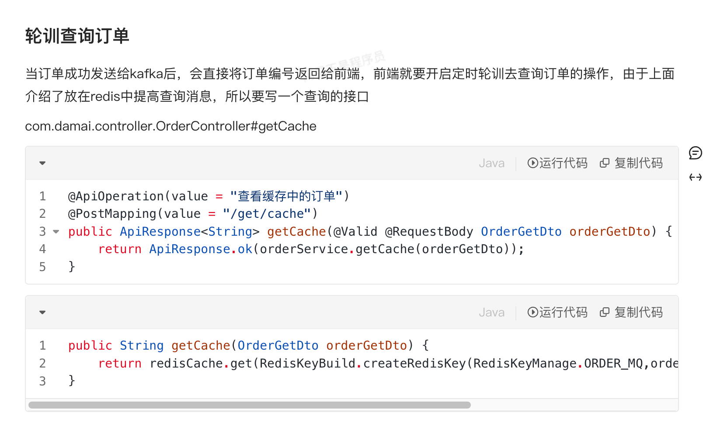

------

# 订单服务

## 远程支付服务

### 支付流程

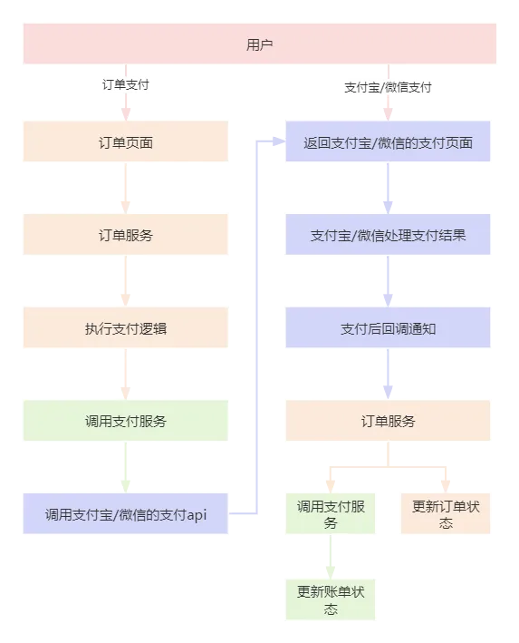

------

### 支付页面

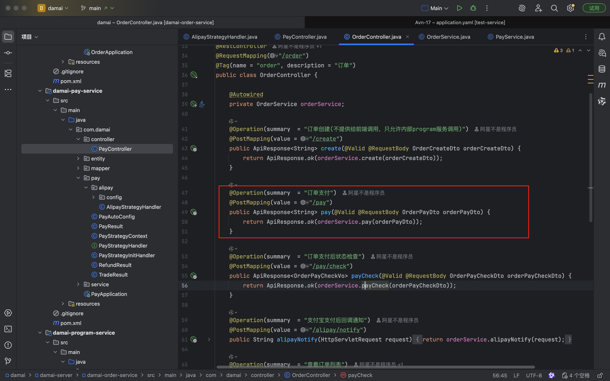

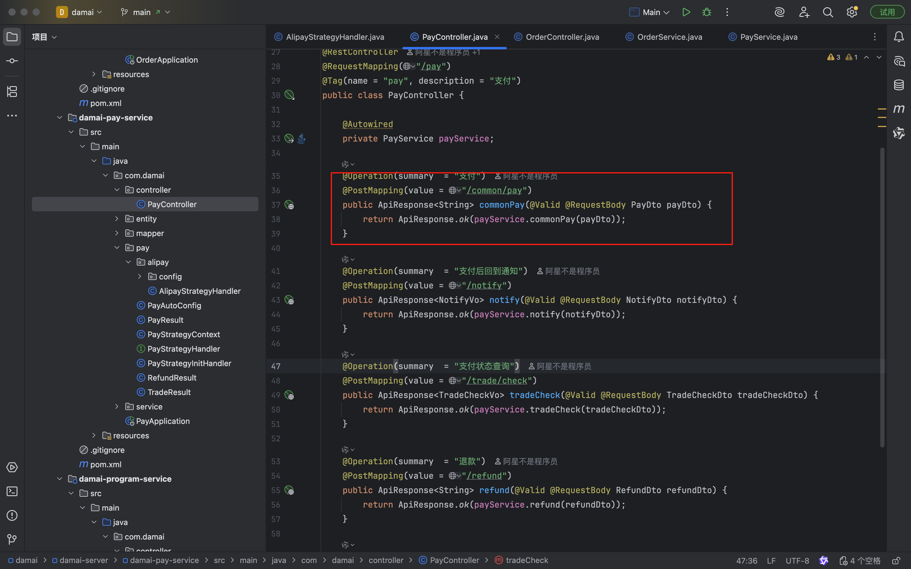

**返回一个支付宝的html页面**
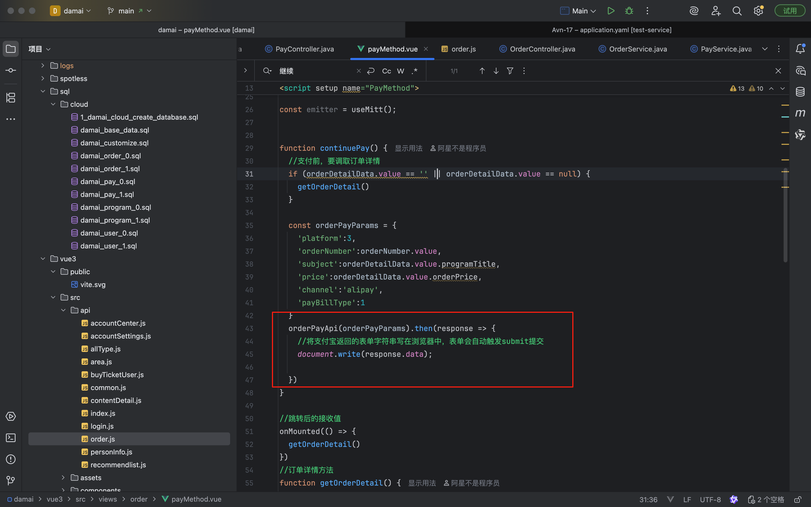

==这个界面询问是否继续浏览器付款 随后将返回的表单写入页面会执行自动提交 然后跳转到支付宝的页面，后续操作基于支付宝==

```html
<!-- 商户生成的表单 -->
<form name="punchout_form" method="post" action="https://openapi.alipay.com/gateway.do">
    <!-- 各种参数字段 -->
    <input type="hidden" name="biz_content" value="..."/>
    <!-- 更多隐藏字段 -->
    <input type="submit" value="立即支付" style="display:none"/>
</form>
<!-- 自动提交脚本 -->
<script>document.forms[0].submit();</script>
```

支付成功后

==主动查询方案==

```
前端 paySuccess.vue (页面加载)
        ↓
调用 payCheckApi (请求订单支付状态检查)
        ↓
OrderController.payCheck (订单服务) 更新订单状态
        ↓
PayClient.tradeCheck (调用支付服务) 
        ↓
PayController.tradeCheck (支付服务) 更新pay_bill状态
        ↓
调用支付宝API查询实际支付状态
```

==支付宝异步回调方案==

```
支付宝服务器
      ↓ (异步回调)
OrderController.alipayNotify (订单服务) 更新订单状态
      ↓ (调用支付服务)
PayController.notify (支付服务) 更新pay_bill状态
      ↓
更新支付账单状态
```

支付页面中 点击"继续继续浏览器付款"后页面就跳转到支付宝页面由支付宝管控 当支付成功才跳转回成功页面 还有就是我查看了paysuccess源码 #paySuccess.vue 35-51 这里即使订单状态没有显示为成功也仍然显示支付成功字样

------

## 为何订单这个重要业务也能异步进行？

创建订单过程是加锁执行的 因此如果不尽快处理就会导致阻塞很久 创建订单业务一般都要求采用同步是因为要返回给前端==订单号== 后续要==根据这个订单号进行支付操作== ==要保证订单在数据库存在== 

**该业务进行了以下处理使得订单创建业务也可以异步进行**

- 在节目服务根据基因法创建订单编号，因此能直接返回给前端，异步创建订单，分库分表把订单编号作为分片键
- 通过Countdownlatch等待kafka发送消息完成，若发送失败则回滚余票、座位状态并抛出异常
- [确保了订单创建成功后才能进行支付](#Kafka异步消费订单)

------

### Kafka异步消费订单

创建订单是==异步==的，因此前端需要==轮询查看订单是否创建成功==(Redis)决定是否给用户显示支付界面,设置的是轮询5秒，因此kafka消费方如果接收到的是超过5s的消息则丢弃，回滚redis中的余票和座位状态

- 消息超过5s丢弃并回滚余票和座位状态

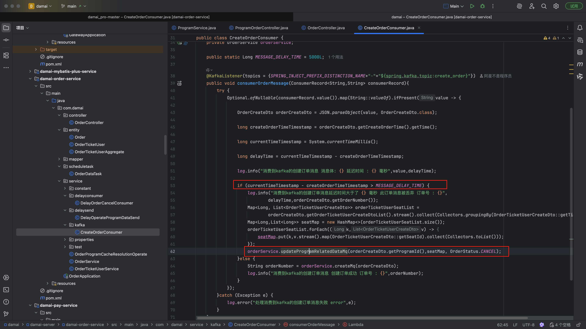

- 订单服务消费kafka消息创建订单成功在redis设置成功标识 前端跳转支付页面
  - 当getOrderCache返回的response.data不为空时，表示订单已成功创建
    停止轮询，关闭loading弹框
  - 跳转到支付页面：router.replace({path:'/order/payMethod',state:{'orderNumber':orderNumberCache.value}})

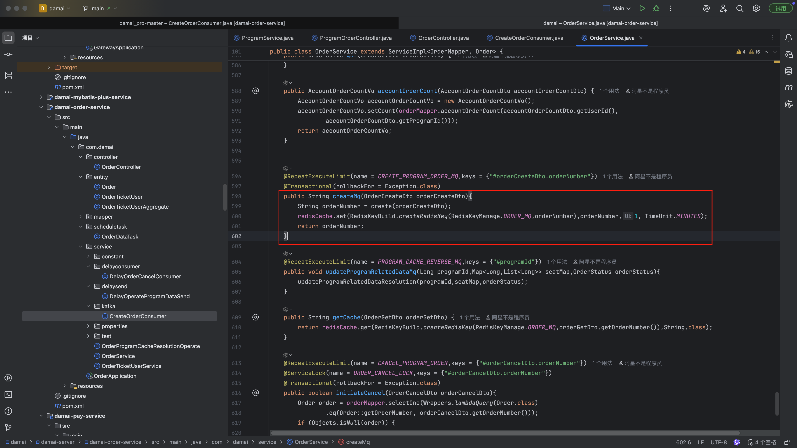

### 基因法

基因法的userId%tablecount 是==根据表数量取模== 定位库时取这后几位基因定位 定位表时直接对表数量取模 由于表数量是2^n 所以基因位相同就可以保证定位到同一表 所以最终同一用户下订单能定位同一库表

- 基因生成 `userId % tableCount`

```java
// SnowflakeIdGenerator.getOrderNumber 方法
public synchronized long getOrderNumber(long userId,long tableCount) {
    long timestamp = getBase();
    long sequenceShift = log2N(tableCount);
    return ((timestamp - BASIS_TIME) << timestampLeftShift)
            | (datacenterId << datacenterIdShift)
            | (workerId << workerIdShift)
            | (sequence << sequenceShift)
            | (userId % tableCount); // 这就是基因部分
}
```

-  数据库定位：提取基因位

```java
    public long calculateDatabaseIndex(Integer databaseCount, Long splicingKey, Integer tableCount) {
        // 将分片键转为二进制字符串（如 123 → "1111011"）
        String splicingKeyBinary = Long.toBinaryString(splicingKey);

        // 计算“基因”长度：log2(表分片数)，即需要多少位来表示所有表
        long replacementLength = log2N(tableCount);

        // 从二进制串末尾截取“基因段”（低位）
        String geneBinaryStr = splicingKeyBinary.substring(
                splicingKeyBinary.length() - (int) replacementLength);

        // 若基因段非空
        if (StringUtil.isNotEmpty(geneBinaryStr)) {
            // ❗当前实现：使用字符串哈希（存在跨JVM不一致风险）
            int h;
            int geneOptimizeHashCode = (h = geneBinaryStr.hashCode()) ^ (h >>> 16);
            // 使用位运算取模（要求 databaseCount 是2的幂）
            return (databaseCount - 1) & geneOptimizeHashCode;
        }

        // 基因段为空，抛异常（理论上不应发生）
        throw new DaMaiFrameException(BaseCode.NOT_FOUND_GENE);
    }
```

- 表定位：直接取模

```java
// TableOrderComplexGeneArithmetic.doSharding 方法
@Override
public Collection<String> doSharding(Collection<String> allActualSplitTableNames, 
                                    ComplexKeysShardingValue<Long> complexKeysShardingValue) {
    // ...
    if (Objects.nonNull(value)) {
        // 直接使用 value 与 (shardingCount - 1) 进行位运算得到表索引
        actualTableNames.add(logicTableName + "_" + ((shardingCount - 1) & value));
        return actualTableNames;
    }
    // ...
}
```

------

# 操作记录解决一致性问题

### 1. Redis中新增记录表

==在创建订单扣减库存的同时在Redis中新增一条记录==

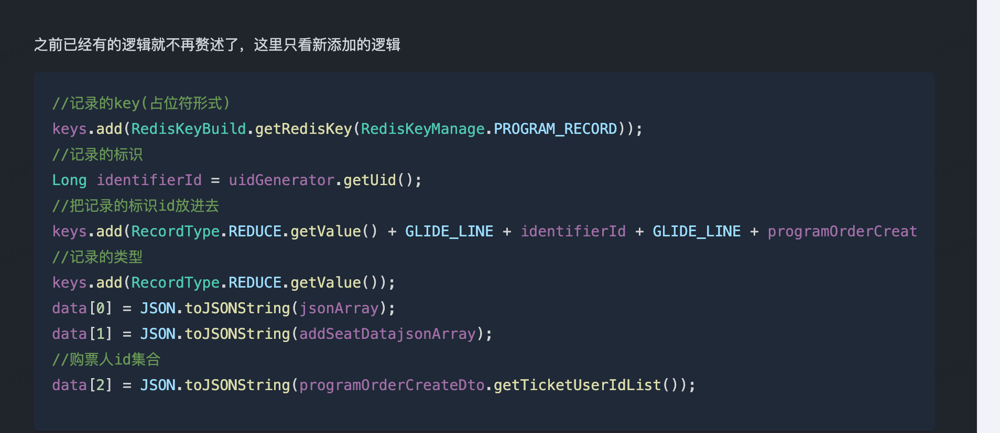

- 记录标识：通过id生成器生成的uid
- 记录类型：分为扣减库存、恢复余票、座位状态修改
- 记录数据拼接操作在lua中进行


#### Hash结构

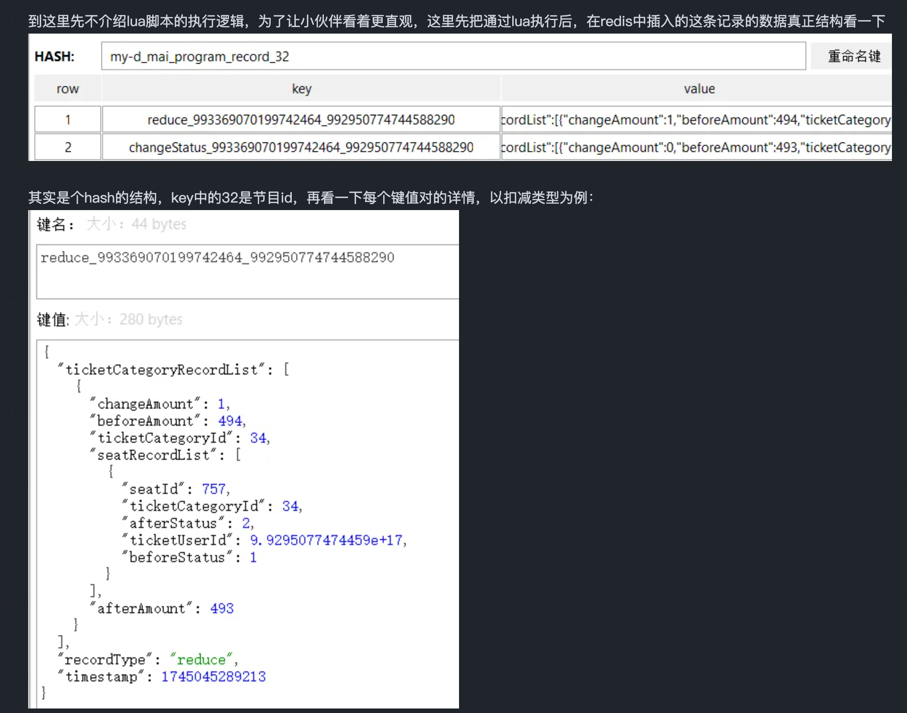

- 大key(32)为节目id
- Hash中key为记录类型-记录id-下单用户id

------

### 2. MySql中新增记录

#### **1. 下单时，在发送Mq创建订单前插入一条记录**

- 定时任务可以直接取这个表中存在的节目进行对账而不是全部取出来对比

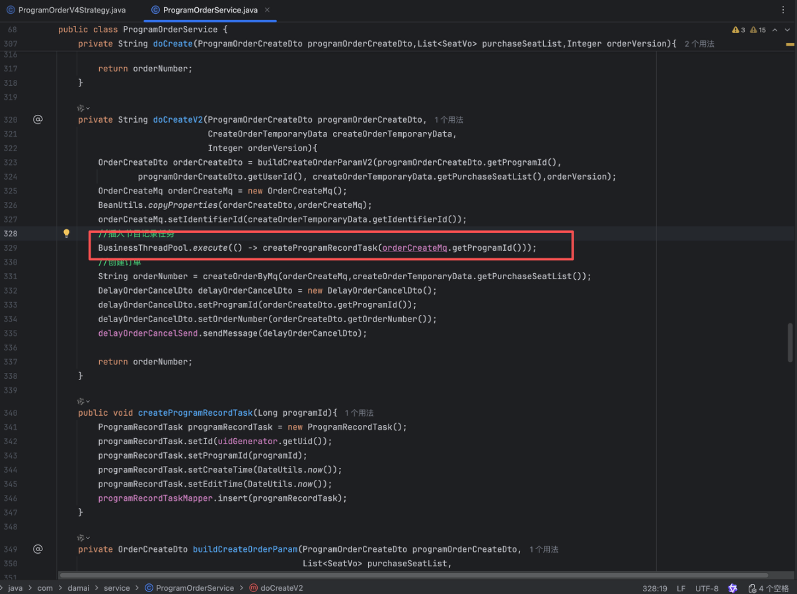

#### **2. 收到创建订单消息后直接同步节目服务数据库中余票**

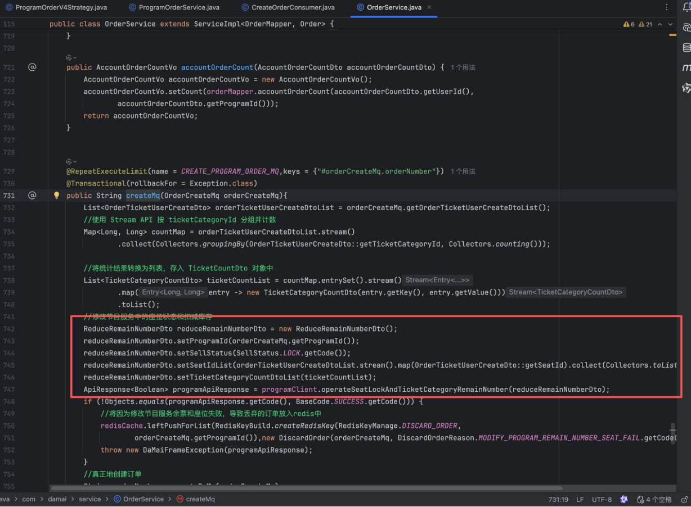

#### 3. 创建订单同时新增记录

- 每个购票人记录中关联的是同一个记录id 

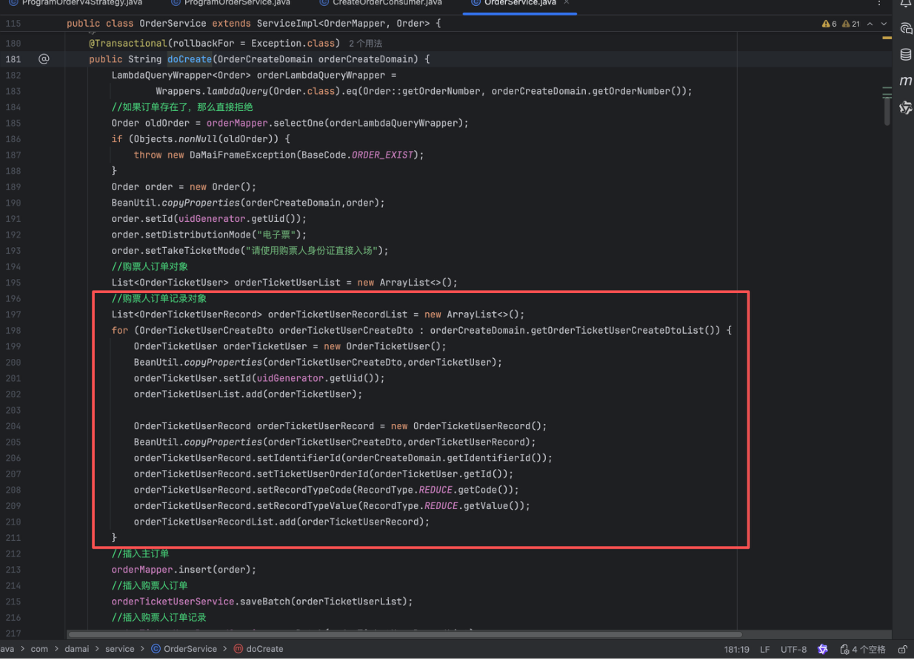


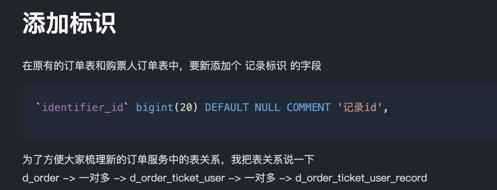

#### 4. 在节目订单这张表加一个记录

- 对账使用

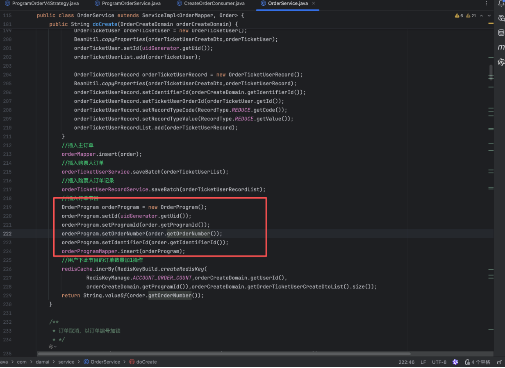

#### 5. 支付/退款回调成功会新增记录

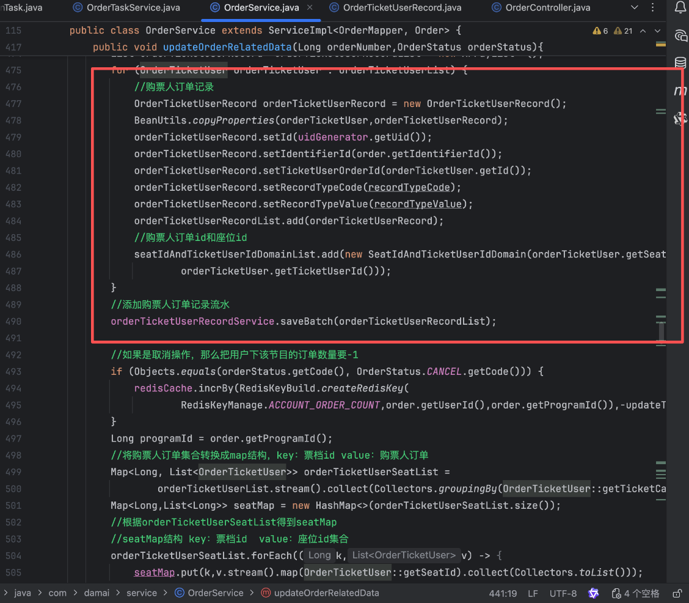

------

### 3. 对比记录

#### 3.1 查询要对账的节目

==这里使用到前面发送kafka前插入的节目数据==

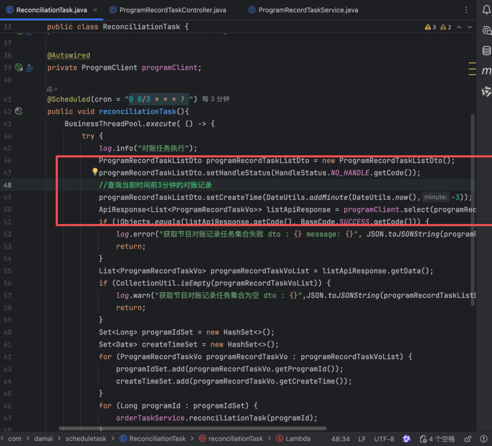

- 定时任务定时对账
- 通过rpc调用节目服务查找三分钟前的记录节目
- 查前三分钟是为了防止节目服务发送kafka但是消息还未被消费的记录被读取

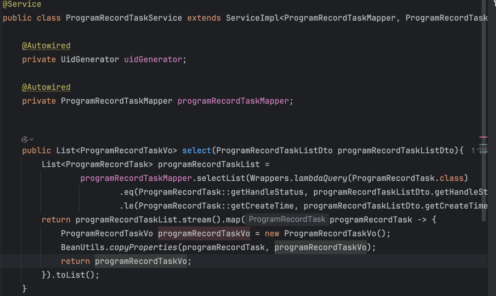

#### 3.2 进行对账

- 通过节目id查询Redis下的记录用来双向对账
- 以Redis为标准对账
  - 将Redis中的数据转为(IdentifyId_userId,recordType)键值对
  - 根据这个dentifyId_userId查询数据库中订单人记录表并转为(recordType,value)键值对
  - 遍历记录将Redis和Mysql中的记录进行对比
    - 两个都没有数据--==无需对账 正常==
    - Redis有而Mysql没有--Kafka消息丢失 
    - Redis没有而Mysql有--Redis消息丢失
    - 二者都有数据

- 以Mysql为标准对账
  - 根据节目id查询出购票人订单记录
  - 进行对比


==比对的是同一identifyId下操作记录是否相同==

#### 3.3 数据不一致返回结果

**Redis缺失记录为例**

```json
[
    {
        "examinationRecordTypeResultList": [
            {
                "examinationSeatResult": {
                    "dbStandardStatisticCount": 0,
                    "needToDbSeatRecordList": [

                    ],
                    "needToRedisSeatRecordList": [
                        {
                            "createTime": 1744890121000,
                            "createType": 1,
                            "editTime": 1745233944000,
                            "id": 988036713682436098,
                            "identifierId": 988037984992780288,
                            "orderNumber": 1912833918217224202,
                            "orderPrice": 380,
                            "programId": 32,
                            "reconciliationStatus": 1,
                            "recordTypeCode": 0,
                            "recordTypeValue": "changeStatus",
                            "seatId": 752,
                            "seatInfo": "1排2列",
                            "status": 1,
                            "ticketCategoryId": 34,
                            "ticketUserId": 927653802827100032,
                            "ticketUserOrderId": 988036713682436097,
                            "userId": 927653802827104258
                        }
                    ],
                    "redisStandardStatisticCount": 0
                },
                "recordTypeCode": 0,
                "recordTypeValue": "changeStatus"
            }
        ],
        "identifierId": "988037984992780288",
        "userId": "927653802827104258"
    }
]
```

返回结果是同一订单下(全程使用的是同一记录id),缺失的记录(扣减、状态变更、订单取消)

------

## 缓存延迟双删

缓存一致性问题发生在 第一次读取为空时在数据库读取并写入缓存 但是这时候发生网络问题写入缓存慢了 恰好这时候有mysql写入操作更新缓存 但由于这时候缓存为空加上之前读取到的是旧值导致网络恢复时写入Redis的也是旧值 这个问题可以通过延迟双删来解决

https://www.bilibili.com/video/BV1EyXQYJEF5/?spm_id_from=333.1387.search.video_card.click&vd_source=fd0b7243ae5b04e4d46b23923b639f5b

------

## 总结

**1. redis扣减库存成功但是写入记录失败 ~~mysql扣减库存也成功了 但是创建订单和写入记录也失败了 就导致空扣了一票 怎么解决的~~**

> 在售票完成后,比对订单、账单数量和余票是否一致,不一致则放

**2. 怎么做操作记录的 怎么保证数据一致性的**

**创建记录:** 

> 1. 在下单的时候扣减完Redis余票,==更改完位置状态后会在Redis中新增==一条扣减余票的操作记录 记录包含了订单的信息以及扣减前后数量  
> 2. 然后Kafka发送创建订单消息 创建订单前会==先将余票和座位信息同步到数据库== 创建订单后在Mysql中新增对应购票订单人的操作记录 
> 3. 支付成功/退款 也会在==Redis和Mysql新增记录==

**对账:**

> 1. Redis Mysql都没数据: 有可能出现在Redis中余票扣成功了但是记录没写宕机同时主从也同步了这一数据 可能会导致Redis扣票了Mysql没扣但==没法感知导致少卖==
>    - 我的想法是==恰赶上Redis宕机时报错的话 然后删除Redis新主节点的缓存==重新在Mysql同步
>    - 如果哨兵已经切换节点了感知不到那只能少卖了 问题不大,售票结束对一下票数就好
> 2. Redis中有记录而Mysql缺记录: 主要发生在==Kafka丢消息、消息延迟==、出现异常导致创建订单等场景 
>    - ==删除Redis余票和座位缓存== 重新从Mysql同步
>    - 向mysql补数据很麻烦，因为有可能在马上要执行这个补的操作时候，Redis发生主节点宕机，从节点切换后这个数据丢失了，所以不要以一个不稳定的数据源作为依据，除非能容忍丢失 
>    - 消息延迟的记录可以直接通过数据回滚进行恢复
>    - Redis中扣减的那张票直接废弃就好 反正Mysql订单没创建成功 票也没少 用户在前端页面也不会跳到支付页面支付
> 3. Mysql有记录而Redis缺记录:发生在==Redis的AOF/RDB未刷盘宕机、主从切换未同步导致数据丢失==
>    - 直接==补记录然后删除缓存==重新同步即可

==清除的是Redis下有异常的票档的座位和余票信息==

1. 在Redis扣减库存成功后，Redis宕机了怎么办？

   > 主从+哨兵 但是可能会发生主从切换导致Redis中余票和座位未扣减但是Mysql已经下单 通过记录比对删除Redis缓存同步Mysql可以解决

2. 通过lua在Redis执行扣减库存执行过程中，Redis宕机了怎么办？

   > 这时候会抛出异常,删除缓存重新在Mysql同步即可

3. 扣减库存成功后，Kakfa宕机了怎么办？

   > - Kafka集群+同步刷盘可以解决
   >
   > - 会有Redis操作记录而Mysql没有 对账时可以发现并重构缓存 

4. 扣减库存成功后，Kakfa的消息丢了，没有创建出订单怎么办？

   > 同3

5. 扣减库存成功后，Kafka没有宕机，但收到消息延迟了怎么办？

   > 订单丢弃并回滚

这样看起来补记录意义不太大?毕竟数据都同步完成了 是用来给管理员看的吗

==总结起来就是对账记录的时候不一致则删除Redis中余票和座位信息缓存,以Mysql的数据为准重构缓存==

------

#  	 用户注册业务


**关键组件：**

1. lua脚本
2. 验证码组件
3. 校验树
4. 布隆过滤器

## 校验操作

```
检查是否需要验证码：无参数
获取验证码：
captchaType: 验证码类型（如blockPuzzle滑块、clickWord点选）
验证验证码：
captchaType: 验证码类型
pointJson: 用户操作坐标或距离（可能经过AES加密）
token: 验证码唯一标识
注册时二次验证：
captchaId: 验证码ID
captchaVerification: 验证码验证结果（用于后端二次校验）
```

1. 用户发起注册请求
   -> 业务服务生成 captchaId
   -> 返回 captchaId 给前端
2. 前端请求获取验证码 
   -> 验证码服务生成验证码和 token
   -> 返回验证码图片和 token 给前端

所需参数：

- RemoteAddr(浏览器自带)

  ```java
   RequestAttributes requestAttributes = RequestContextHolder.getRequestAttributes();
          assert requestAttributes != null;
          HttpServletRequest request = ((ServletRequestAttributes) requestAttributes).getRequest();
          captchaVO.setBrowserInfo(RemoteUtil.getRemoteId(request));
  ```

- ClientUid(使用 Md5Util.md5() 方法对 browserInfo 进行 MD5 加密，作为 ClientUid或者通过前端手动传入的ClientUid) 作验证码重试次数限流

  ```java
  protected String getValidateClientId(CaptchaVO req){
      	// 以服务端获取的客户端标识 做识别标志
  		if(StringUtils.isNotEmpty(req.getBrowserInfo())){
  			return Md5Util.md5(req.getBrowserInfo());
  		}
  		// 以客户端Ui组件id做识别标志
  		if(StringUtils.isNotEmpty(req.getClientUid())){
  			return req.getClientUid();
  		}
      	return null;
  	}
  ```

- type(前端传入验证码类型)

  ```java
  public ResponseModel get(CaptchaVO captchaVO) {
          if (captchaVO == null) {
              return RepCodeEnum.NULL_ERROR.parseError("captchaVO");
          }
          if (StringUtils.isEmpty(captchaVO.getCaptchaType())) {
              return RepCodeEnum.NULL_ERROR.parseError("类型");
          }
          return getService(captchaVO.getCaptchaType()).get(captchaVO);
      }
  ```

3. 用户完成验证码验证 
   -> 前端提交 token 和验证结果给业务服务

后端将token+坐标信息、value加密组合作为key token作为value存入redis用于二次校验

> 将 token 和坐标信息用 AES 加密生成 value
> 以 REDIS_SECOND_CAPTCHA_KEY 为前缀，将加密后的 value 作为键，token 作为值存储到缓存中
> 设置过期时间为 3 分钟 (EXPIRE_SIN_THREE)
> 将加密后的 value 设置为 captchaVerification 返回给前端

返回CaptchaVerification

4. 用户提交注册请求
   -> 前端提交 captchaId 和CaptchaVerification
   -> 业务服务通过 captchaId 关联并验证验证码

```java
@Override
public ResponseModel verification(CaptchaVO captchaVO) {
    if (captchaVO == null) {
        return RepCodeEnum.NULL_ERROR.parseError("captchaVO");
    }
    if (StringUtils.isEmpty(captchaVO.getCaptchaVerification())) {
        return RepCodeEnum.NULL_ERROR.parseError("二次校验参数");
    }
    try {
        String codeKey = String.format(REDIS_SECOND_CAPTCHA_KEY, captchaVO.getCaptchaVerification());
        if (!CaptchaServiceFactory.getCache(cacheType).exists(codeKey)) {
            return ResponseModel.errorMsg(RepCodeEnum.API_CAPTCHA_INVALID);
        }
        //二次校验取值后，即刻失效
        CaptchaServiceFactory.getCache(cacheType).delete(codeKey);
    } catch (Exception e) {
        logger.error("验证码坐标解析失败", e);
        return ResponseModel.errorMsg(e.getMessage());
    }
    return ResponseModel.success();
}
```

以传入的 captchaVerification 作为键，构造缓存键 codeKey

- 检查该键在缓存中是否存在

- 如果存在，则删除该键（一次性使用，即刻失效）

- 返回验证成功结果

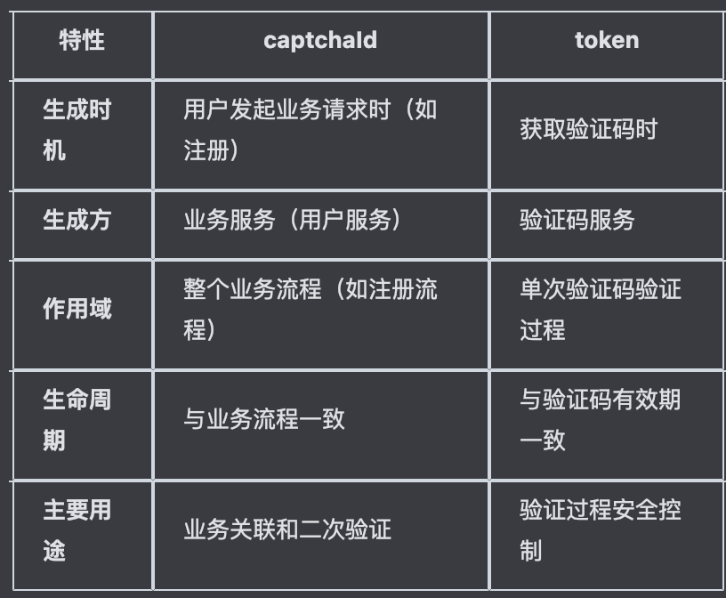

---
# AI模块


## ChatClient初使用

> `ChatClient` 是一个用于与 LLM 进行聊天（对话）交互的客户端封装。
> 它屏蔽了很多底层 HTTP 调用、请求构造、响应解析等细节，开发者只需要通过它简单的 API，就可以发起问题并得到 AI 的回答。

### 核心功能

- 自动注入底层模型（如 OpenAI、DeepSeek 等）
- 支持设置默认的 system prompt（系统角色描述）
- 支持拦截器（advisor）扩展，比如记录日志、预处理消息等
- 提供同步/异步的聊天接口

### 配置使用

1. 依赖引入

   > 父模块: 进行AI依赖版本控制
   >
   > ```xml
   > <dependencyManagement>
   >     <dependencies>
   >         <dependency>
   >             <groupId>org.springframework.boot</groupId>
   >             <artifactId>spring-boot-dependencies</artifactId>
   >             <version>${spring.boot.version}</version>
   >             <type>pom</type>
   >             <scope>import</scope>
   >         </dependency>
   >         <dependency>
   >             <groupId>org.springframework.ai</groupId>
   >             <artifactId>spring-ai-bom</artifactId>
   >             <version>${spring-ai.version}</version>
   >             <type>pom</type>
   >             <scope>import</scope>
   >         </dependency>
   >     </dependencies>
   > </dependencyManagement>
   > ```
   >
   > Deepseek依赖
   >
   > ```java
   > <dependency>
   > <groupId>org.springframework.ai</groupId>
   > <artifactId>spring-ai-starter-model-deepseek</artifactId>
   > </dependency>
   > ```

`注：` 相关模型依赖下间接引入`spring-ai-core` 提供相关的AI接口

1. 配置

   > ```java
   > @Bean
   >     public ChatClient chatClient(DeepSeekChatModel model) {
   >         return ChatClient
   >                 .builder(model)
   >                 .build();
   >     }
   > ```
   >
   > - `public ChatClient chatClient(DeepSeekChatModel model)`
   >   - 定义一个返回 `ChatClient` 的 Bean 方法，并接收一个 `DeepSeekChatModel` 对象作为参数。
   >   - `DeepSeekChatModel` 是 Spring AI 中对 DeepSeek 模型的封装，负责和 DeepSeek API 通信。
   > - `ChatClient.builder(model)`
   >   - 创建一个 `ChatClient` 的构建器，告诉客户端使用哪个模型。
   > - `.build()`
   >   - 构建最终的 `ChatClient` 实例。

2. 使用

```java
@RestController
@RequestMapping("/simple")
public class SimpleChatController {

    @Resource
    private ChatClient chatClient;


    @RequestMapping(value = "/chat", produces = "text/html;charset=utf-8")
    public Flux<String> chat(@RequestParam("prompt") String prompt) {
        return chatClient.prompt()
                //传入用户的对话
                .user(prompt)
                //进行流式调用
                .stream()
                //返回内容
                .content();
    }
}
```

3. 前端

> 传统的 **AJAX**（如 $.ajax 或 axios）并不适合处理流式（Streaming）结果，因为它们的设计初衷是“**等待响应完成后一次性返回**”。
>
> 要接收 Spring AI 的 Flux 流式数据并在前端实时显示，目前最主流、最简单的方案是使用浏览器原生的 **Fetch API**。

```js
<!DOCTYPE html>
<html>
<head>
    <title>Spring AI Stream</title>
</head>
<body>
    <input type="text" id="prompt" placeholder="输入问题..." style="width: 300px;">
    <button onclick="sendChat()">发送</button>
    <div id="chat-box" style="margin-top:20px; border:1px solid #ccc; padding:10px; min-height: 100px; white-space: pre-wrap;"></div>

    <script>
        async function sendChat() {
            const prompt = document.getElementById('prompt').value;
            const chatBox = document.getElementById('chat-box');
            chatBox.innerText = ""; // 清空旧内容

            try {
                // 1. 使用 Fetch 发送请求
                const response = await fetch(`/simple/chat?prompt=${encodeURIComponent(prompt)}`);
                
                // 2. 获取响应体的读取器 (Reader)
                const reader = response.body.getReader();
                const decoder = new TextDecoder();

                // 3. 循环读取流数据
                while (true) {
                    const { done, value } = await reader.read();
                    if (done) break; // 读取完毕，退出循环

                    // 4. 将字节数据转换为文本并追加到 UI
                    const chunk = decoder.decode(value, { stream: true });
                    chatBox.innerText += chunk;
                }
            } catch (error) {
                console.error("读取流失败:", error);
            }
        }
    </script>
</body>
</html>
```

*以上可以实现一个简单的LLM调用以及流式返回*

### 日志

> 请求 --> Advisor 前置处理 --> 模型调用 --> Advisor 后置处理 --> 返回响应


```java
@Bean
public ChatClient chatClient(DeepSeekChatModel model) {
    return ChatClient
            .builder(model)
            .defaultAdvisors(
                    // 添加日志组件
                    new SimpleLoggerAdvisor()
            )
            .build();
}
```

`注:`**SimpleLoggerAdvisor的打印日志级别是debug**

```java
private void logRequest(ChatClientRequest request) {
    logger.debug("request: {}", this.requestToString.apply(request));
}

private void logResponse(ChatClientResponse chatClientResponse) {
    logger.debug("response: {}", this.responseToString.apply(chatClientResponse.chatResponse()));
}
```

**设置为debug**

```yaml
logging:
  level:
    # 设置 SimpleLoggerAdvisor 所在的包级别为 DEBUG
    org.springframework.ai.advisors: DEBUG
```

### 提示词

```java
@Bean
public ChatClient chatClient(DeepSeekChatModel model) {
    return ChatClient
            .builder(model)
            //设置默认提示词 也可以在使用的时候通过system进行设置
            .defaultSystem("你是一位智能助手，你的特点是温柔、善良，你的名字叫智能小艾，要结合你的特点积极的回答用户的问题。")
            .defaultAdvisors(
                    new SimpleLoggerAdvisor()
            )
            .build();
}
```

## 会话历史保存

### 配置使用

1. 配置
   **ChatMemory**

   > Chatmemory是实现会话存储的接口 真正实现保存的操作是靠 chatMemoryRepository 来执行的 chatMemoryRepository默认是内存存储(ConditionOnMissingBean) 因此引入jdbc相关依赖可以替代这个Bean

   **依赖引入**
   *引入jdbc相关依赖*

   ```xml
   <dependency>
       <groupId>com.mysql</groupId>
       <artifactId>mysql-connector-j</artifactId>
   </dependency>
   <dependency>
       <groupId>org.springframework.ai</groupId>
       <artifactId>spring-ai-starter-model-chat-memory-repository-jdbc</artifactId>
   </dependency>
   ```

   ```yaml
   # 这样就可以将chatId和会话内容保存到数据库中了，并且表是自动创建的 
   ai:
   chat:
     memory:
       repository:
         jdbc:
           initialize-schema: always #告诉 Spring AI，每次应用程序启动时都去尝试执行初始化脚本。
           platform: mariadb #告诉 Spring AI 使用哪种数据库方言的脚本。 指定 mariadb 后，它会自动去寻找对应的 MariaDB 专用语法脚本。	
   ```

2. 配置Bean
   **ChatMemory**

   ```java
   @Bean
      public ChatMemory chatMemoryRepository(ChatMemoryRepository chatMemoryRepository){
          return 
          //取最近十条 user&assistant
          MessageWindowChatMemory.builder().chatMemoryRepository(chatMemoryRepository)
                  .maxMessages(10).build();
      }
   ```

   **Client**

   ```java
   @Bean
   public ChatClient assistantChatClient(DeepSeekChatModel model, ChatMemory chatMemory) {
      return ChatClient
              .builder(model)
              .defaultSystem(DaMaiConstant.DA_MAI_SYSTEM_PROMPT)
              .defaultAdvisors(
                      new SimpleLoggerAdvisor(),
                      MessageChatMemoryAdvisor.builder(chatMemory).build()
              )
              .defaultTools(aiProgram)
              .build();
   }
   ```

3. 修改对话功能

   ```java
   @RequestMapping(value = "/chat", produces = "text/html;charset=utf-8")
   public Flux<String> chat(@RequestParam("prompt") String prompt,
                        @RequestParam("chatId") String chatId) {
       // 请求模型
       return assistantChatClient.prompt()
       .user(prompt)
       //传入ID
       .advisors(a -> a.param(ChatMemory.CONVERSATION_ID, chatId))
       .stream()
       .content();
   }
   ```

------

## 保存不同会话列表(自定义Advisor)

> 注意到 MessageChatMemoryAdvisor 是继承了 BaseChatMemoryAdvisor ，实现了这两个方法 before 和 after，这是不是 AOP 切面很像很像！没错，这就是和切面一个意思

**什么是 BaseChatMemoryAdvisor**

> BaseChatMemoryAdvisor 是 Spring AI 提供的一个抽象类，目的是允许开发者在 AI 请求执行的前后对 对话记忆（Chat Memory） 进行拦截和处理。它实现了 Spring AOP 的 Advisor，可以与 AI 的 ChatClient 流程集成。它提供了两个关键的钩子方法：`before`、`after`，通过继承 BaseChatMemoryAdvisor，你可以自定义对话记忆的读写策略、日志记录、上下文注入等。

------

### 实现

模仿MessageChatMemoryAdvisor实现BaseChatMemoryAdvisor重写`before`&`after`方法 并仿造其建造者模式
**核心方法:**

```java
@Override
public ChatClientRequest before(final ChatClientRequest chatClientRequest, final AdvisorChain advisorChain) {
    String conversationId = getConversationId(chatClientRequest.context(), this.defaultConversationId);
    chatTypeHistoryService.save(type,conversationId);
    return chatClientRequest;
}
```

**表结构**

```sql
CREATE TABLE `d_chat_type_history` (
 `id` bigint NOT NULL AUTO_INCREMENT COMMENT '主键id',
 `type` int NOT NULL COMMENT '会话类型，详见ChatType枚举',
 `chat_id` varchar(225) NOT NULL COMMENT '会话id',
 `title` varchar(512) DEFAULT NULL COMMENT '标题',
 `create_time` datetime DEFAULT NULL COMMENT '创建时间',
 `edit_time` datetime DEFAULT NULL COMMENT '编辑时间',
 `status` tinyint(1) DEFAULT '1' COMMENT '1:正常 0:删除',
 PRIMARY KEY (`id`)
) ENGINE=InnoDB AUTO_INCREMENT=65 DEFAULT CHARSET=utf8mb3 COMMENT='会话历史表';
```

**配置**

```java
@Bean
public ChatClient assistantChatClient(DeepSeekChatModel model, ChatMemory chatMemory, AiProgram aiProgram,
                                      ChatTypeHistoryService chatTypeHistoryService,@Qualifier("titleChatClient")ChatClient titleChatClient) {
    return ChatClient
            .builder(model)
            .defaultSystem(DaMaiConstant.DA_MAI_SYSTEM_PROMPT)
            .defaultAdvisors(
                    new SimpleLoggerAdvisor(),
                    //新增Advisor
            ChatTypeHistoryAdvisor.builder(chatTypeHistoryService).type(ChatType.ASSISTANT.getCode()).order(CHAT_TYPE_HISTORY_ADVISOR_ORDER).build(),
                    MessageChatMemoryAdvisor.builder(chatMemory).order(MESSAGE_CHAT_MEMORY_ADVISOR_ORDER).build()
            )
            .defaultTools(aiProgram)
            .build();
}
```

------

## FunctionCalling

> SpringAI 的 Function Calling 大致包括以下步骤：
>
> 1. 事先注册“工具”
>    在 SpringAI 中，你需要先将所有可调用的业务逻辑（比如查询天气、下单、发送邮件等）封装成独立的 Function（SpringAI 里称为 Tool），并为它们命名、说明用途、定义输入参数格式。
> 2. 构建上下文提示
>    把这些 Tool 的元信息（名称、功能介绍、参数 Schema）整合到 Prompt 中，与用户的原始问题一并发给大模型，让模型知道有哪些能力可用及其使用方式。
> 3. 模型判断调用时机
>    在对话过程中，模型会根据用户的提问或上下文内容，智能地决定是否需要启用某个 Tool 来获取数据或执行操作，而不是始终只靠自身的“静态”知识库。
> 4. 返回调用指令
>    一旦模型认为应调用某个工具，它会在响应中以结构化的形式（包含 tool 名称和填好的参数）告诉应用：“请执行这个 Function，参数如下”。
> 5. 本地执行并反馈
>    Java 端收到模型的调用指令后，解析出要调用的具体 Function 和对应参数，执行相应业务逻辑，并将执行结果（无论是数据还是状态）再包装成文本或 JSON，反馈给大模型。
> 6. 持续对话与结果整合
>    模型拿到执行结果后，继续基于新的信息生成后续回复或下一步动作，双方如此循环，直到完成用户所需的整个任务。

### 配置使用

1. 对要被调用的方法加上Tool注解并附上描述供LLM理解使用

```java
	@Component
	public class AiProgram {
	
	
	@Tool(description = "根据地区或者类型查询推荐的节目")
	public List<ProgramSearchVo> selectProgramRecommendList(@ToolParam(description = "查询的条件", required = true) ProgramRecommendFunctionDto programRecommendFunctionDto){
		
	}
	
}
```

1. 对于DTO 加上适当描述

```java
@Data
public class ProgramRecommendFunctionDto {

@ToolParam(required = false, description = "节目演出地点")
private String areaName;

@ToolParam(required = false, description = "节目类型")
private String programCategory;
}
```

1. 对ChatClient进行配置

```java
@Bean
public ChatClient assistantChatClient(DeepSeekChatModel model, ChatMemory chatMemory, AiProgram aiProgram) {
    return ChatClient
            .builder(model)
            .defaultSystem(DaMaiConstant.DA_MAI_SYSTEM_PROMPT)
            .defaultAdvisors(
                    new SimpleLoggerAdvisor(),
                    MessageChatMemoryAdvisor.builder(chatMemory).order(MESSAGE_CHAT_MEMORY_ADVISOR_ORDER).build()
            )
            //添加Tool
            .defaultTools(aiProgram)
            .build();
}
```

具体实现根据业务进行对应操作即可

------

## 会话标题自动化更新

前面通过自定义`advisor`在用户发送`prompt`后会在表中保存一份记录 但是只是保存了会话的`id `对于`titile`是没有进行赋值的 这一部分则是将这个会话的`title`补全
**更新标题的时机应该是在和 ai 对话后，产生了具体的内容后。因此标题的执行时机要在 MessageChatMemoryAdvisor 的 after 方法之后执行，因为这样才能拿到，用户问ai，ai再回复，这一整个完整来回的对话内容。**

执行流程图

```text
调用入口
   │
A.before
   │
B.before
   │
C.before
   │
AI 模型执行
   │
C.after
   │
B.after
   │
A.after
   │
返回结果
```

### 配置使用

1. ChatTypeTitleAdvisor具体实现

**核心实现**

- 先获取到 conversationId，也就是 chatId
- 从 SpringAI 提供的 chatMemory 中，查询到对话具体的内容
- 通过 chatId 和 type 查询到对应的会话聊天
- 判断此会话聊天的标题是否为空，不为空表示已经更新了，就不再执行
- 调用 ai 对查询到对话具体的内容进行总结出标题
- 将标题更新到数据库中

```java
    @Override
    public ChatClientResponse after(final ChatClientResponse chatClientResponse, final AdvisorChain advisorChain) {
        //获取对话id
        String conversationId = getConversationId(chatClientResponse.context(), this.defaultConversationId);
        //数据库获取
        List<Message> messages = chatMemory.get(conversationId);
        List<ChatHistoryMessageVO> list = messages.stream().map(ChatHistoryMessageVO::new).toList();
        log.info("会话记录: {}", JSON.toJSONString(list));
        //获取历史id进行填补
        ChatTypeHistory chatTypeHistory = chatTypeHistoryService.getChatTypeHistory(type, conversationId);
        if (Objects.isNull(chatTypeHistory) || StringUtil.isNotEmpty(chatTypeHistory.getTitle())) {
            return chatClientResponse;
        }
        String content = chatClient.prompt().user("请为以下对话总结一句简洁标题\n" + JSON.toJSONString(list) + "\n 只返回标题文本内容，不要其他样式")
                .call().content();
        
        log.info("生成的标题: {}", content);
        
        ChatTypeHistory updatedChatTypeHistory = new ChatTypeHistory();
        updatedChatTypeHistory.setId(chatTypeHistory.getId());
        updatedChatTypeHistory.setTitle(content);
        chatTypeHistoryService.updateById(updatedChatTypeHistory);
        return chatClientResponse;
    }
```

**重写adviseStream**

```java
    @Override
    public Flux<ChatClientResponse> adviseStream(final ChatClientRequest chatClientRequest, final StreamAdvisorChain streamAdvisorChain) {
        return Mono.just(chatClientRequest)
                .publishOn(scheduler)
                .map(request -> this.before(request, streamAdvisorChain))
                .flatMapMany(streamAdvisorChain::nextStream)
                .transform(flux -> new ChatClientMessageAggregator()
                        .aggregateChatClientResponse(flux,
                                response -> this.after(response, streamAdvisorChain)));
    }
```

按道理说 ChatTypeTitleAdvisor 实现了 after 方法后就可以实现想要的功能了，为什么还要再需要实现 adviseStream 方法？它是干什么用的？

**关键点在于：**

```java
.transform(flux -> new ChatClientMessageAggregator().aggregateChatClientResponse(flux,
                response -> this.after(response, streamAdvisorChain)));
ChatClientMessageAggregator 负责响应流的聚合，聚合完成后才进入 after。
```

说白了就是 `MessageChatMemoryAdvisor` 会等待其他的 `Advisor` 执行完 `after `方法后，再执行 `MessageChatMemoryAdvisor` 的 after 方法。 所以让` ChatTypeTitleAdvisor` 也和 `MessageChatMemoryAdvisor` 一样，也实现 adviseStream 方法。这样对冲一下，结果还是可以让 `ChatTypeTitleAdvisor` 的 `after` 靠后执行了

1. 配置Bean

```java
@Bean
public ChatClient assistantChatClient(DeepSeekChatModel model, ChatMemory chatMemory, AiProgram aiProgram,
                                      ChatTypeHistoryService chatTypeHistoryService,@Qualifier("titleChatClient")ChatClient titleChatClient) {
    return ChatClient
            .builder(model)
            .defaultSystem(DaMaiConstant.DA_MAI_SYSTEM_PROMPT)
            .defaultAdvisors(
                    new SimpleLoggerAdvisor(),
                    ChatTypeHistoryAdvisor.builder(chatTypeHistoryService).type(ChatType.ASSISTANT.getCode()).order(CHAT_TYPE_HISTORY_ADVISOR_ORDER).build(),
                    ChatTypeTitleAdvisor.builder(chatTypeHistoryService).type(ChatType.ASSISTANT.getCode())
                            .chatClient(titleChatClient).chatMemory(chatMemory).order(CHAT_TITLE_ADVISOR_ORDER).build(),
                    MessageChatMemoryAdvisor.builder(chatMemory).order(MESSAGE_CHAT_MEMORY_ADVISOR_ORDER).build()
            )
            .defaultTools(aiProgram)
            .build();
}
public static final Integer MESSAGE_CHAT_MEMORY_ADVISOR_ORDER = Ordered.HIGHEST_PRECEDENCE + 1000;

public static final Integer CHAT_TITLE_ADVISOR_ORDER = Ordered.HIGHEST_PRECEDENCE + 999;
```

**`Order`越小越靠前执行**

------

## RAG

### RAG原理

> RAG（Retrieval-Augmented Generation）是一种结合检索和生成的技术，用于增强大型语言模型（LLM）的回答能力。与传统只依赖模型训练数据不同，RAG允许模型在生成回答时动态检索外部知识库的信息，好比让 AI 进行“开卷考试”。具体来说，RAG 系统通常包括以下步骤：

1. 数据摄取（Ingestion）：将权威信息（如公司文档、数据库等）加载到向量数据库或检索系统中；
2. 检索（Retrieval）：当用户提出问题时，系统将问题转化为向量，并在知识库中搜索语义最相近的内容；
3. 上下文融合（Augmentation）：将检索到的相关信息与用户问题合并，构造新的提示（prompt）给模型；
4. 生成（Generation）：将增强后的提示输入LLM，由模型根据这些上下文生成回答。

通过上述流程，RAG 可以让模型在回答问题时参考实时的、特定领域的知识，从而提高准确性和相关性。例如，我们可以把 RAG 系统比作一个学生做“开卷考试”，学生（LLM）一边答题，一边翻阅教科书（向量数据库中的文档）来查找答案。

在这个过程中，向量模型和向量数据库发挥关键作用：前者将查询和文档转换为数字向量，后者根据向量相似度快速检索相关内容。

**核心流程步骤**

1. Step 1 - 文档预处理

   - 解析：

     > 《节目取消和退票 - 相关问题与回答》
     >
     > 《节目订票 - 相关问题与回答》

   - 切片（Chunk）：

     > 每段拆成合适的小块（如：一句话、一问一答）
     >
     > 向量化（Embedding）：
     >
     > 使用如 text-embedding-3-small 将每个段落生成向量。
     >
     > 存入向量数据库（如：Pinecone、Weaviate、FAISS）

2. Step 2 - 用户提问

   > 用户自然语言输入：
   > 可能关键词不准确，语言表达自由。

3. Step 3 - 语义检索

   > 将用户问题转换为向量。
   > 在向量数据库中进行相似度检索，找出相关语义段落。

4. Step 4 - RAG（检索增强生成）

   > 将检索到的相关内容交给大语言模型（LLM）。
   >
   > LLM 理解用户问题 + 已检索段落，生成自然语言答案。
   >
   > 可以支持补充来源（如引用哪一条规则、来自哪个文档）。

5. Step 5 - 返回结果

   > 直接回答用户问题。
   > 支持追问、多轮对话，持续调用 RAG 流程。

**与 ElasticSearch 对比流程图**

- ElasticSearch 流程

  > ```
  > 用户提问 → 关键词检索 → 文档列表 → 用户自己阅读 → 自行总结答案
  > ```

- RAG + 向量数据库流程

  > ```
  > 用户提问 → 语义检索 → 相关片段召回 → AI 生成答案 → 直接回答用户
  > ```

**RAG和FunctionCall比对**

> 如果用functioncal强行替代rag 那需要写成千上万个functioncall来处理用户多样的请求 但rag的话 可以将零零碎碎结合起来然后让大模型拼凑起这些答案

------

### 实战使用

#### VectorStore 接口概述

> 包路径
> `org.springframework.ai.vectorstore`
>
> 责任
>
> - 向向量数据库添加、删除文档
> - 基于查询文本或元数据过滤执行相似度搜索
>
> 可选地访问底层“原生”客户端

| 方法签名                                                     | 说明                                                         |
| ------------------------------------------------------------ | ------------------------------------------------------------ |
| `void add(List<Document> documents)`                         | 批量添加文档到向量存储                                       |
| `void delete(List<String> idList)`                           | 根据文档 ID 列表删除文档                                     |
| `void delete(Filter.Expression filterExpression)`            | 根据过滤表达式删除文档                                       |
| `List<Document> similaritySearch(String query)`              | 直接以文本生成 Embedding 并搜索最相似文档                    |
| `List<Document> similaritySearch(SearchRequest request)`     | 支持指定 Top-K、相似度阈值、元数据过滤等参数的高级检索       |
| `<T> Optional<T> getNativeClient()`                          | 获取底层向量数据库客户端（如 RedisClient、PineconeClient 等），进行更细粒度操作 |
| `static <T extends VectorStore.Builder<T>> VectorStore.Builder<T> builder(String name)` | 构建器，用于以流式 API 配置并实例化 VectorStore 实现         |

#### 配置使用

1. 引入向量数据库的依赖 `SimpleVectorStore`为例

```xml
<dependency>
    <groupId>org.springframework.ai</groupId>
    <artifactId>spring-ai-advisors-vector-store</artifactId>
</dependency>
```

1. 引入 OpenAI 的依赖

   > 目前 SpirngAI 中的 DeepSeek 只支持对话模型，还并不支持向量模型，所以需要使用 OpenAI 的向量模型，但是OpenAI 需要用手段才可以使用，比较麻烦。
   >
   > 不过好在阿里的 ai 模型，阿里百炼遵守 OpenAI 的规范，所以可以使用 OpenAI 的依赖，实际的调用 ai 是阿里百炼平台

```xml
<dependency>
    <groupId>org.springframework.ai</groupId>
    <artifactId>spring-ai-starter-model-openai</artifactId>
</dependency>
spring:
  application:
    name: damai-ai
  ai:
    openai:
      base-url: https://dashscope.aliyuncs.com/compatible-mode
      api-key: ${对应的key}
      chat:
        options:
          model: qwen-max-latest
      embedding:
        options:
          model: text-embedding-v3
          dimensions: 1024
```

rag依赖

```xml
<dependency>
    <groupId>org.springframework.ai</groupId>
    <artifactId>spring-ai-rag</artifactId>
</dependency>
```

1. 配置VectorStore

```java
@Bean
public VectorStore vectorStore(OpenAiEmbeddingModel embeddingModel) {
    return SimpleVectorStore.builder(embeddingModel).build();
}
```

1. 配置MarkDown文本跟解析器进行切片

- ResourcePatternResolver
  Spring 提供的资源加载工具，可以根据路径模式批量获取资源文件（支持通配符，如 *.md）。
- Document
  文档对象，通常包含文档内容和元数据，用于向量化或其他文档处理场景。
- MarkdownDocumentReader
  Markdown 文档解析工具，把 Markdown 文件切片成小文档（片段），支持配置是否包含代码块、引用块、是否根据分隔线划分。

```java
package com.damai.ai.rag;

import com.damai.utils.StringUtil;
import lombok.AllArgsConstructor;
import lombok.extern.slf4j.Slf4j;
import org.springframework.ai.document.Document;
import org.springframework.ai.reader.markdown.MarkdownDocumentReader;
import org.springframework.ai.reader.markdown.config.MarkdownDocumentReaderConfig;
import org.springframework.ai.reader.markdown.config.MarkdownDocumentReaderConfig.Builder;
import org.springframework.ai.transformer.splitter.TokenTextSplitter;
import org.springframework.core.io.Resource;
import org.springframework.core.io.support.ResourcePatternResolver;

import java.io.IOException;
import java.time.LocalDateTime;
import java.util.ArrayList;
import java.util.List;
import java.util.Map;

@AllArgsConstructor
@Slf4j
public class MarkdownLoader {
    /*
            启动加载
            │
        扫描 classpath:datum/*.md
            │
        找到 N 个文件
            │
        遍历每个文件 ───────────▶ 读取文件名 ──▶ 提取标签 ──▶ 配置解析器 ──▶ 解析文档片段 ──▶ 加入总列表
            │                                                                          │
            └──────────────────────────────────────────────────────────────────────────┘
            │
        记录总共加载的文档片段数
            │
        返回文档片段列表
     */

    //Spring 提供的资源加载工具，可以根据路径模式批量获取资源文件（支持通配符，如 *.md）。
    private final ResourcePatternResolver resourcePatternResolver;

    //Document：文档对象，用于转换成向量
    public List<Document> loadMarkdowns() {
        List<Document> allDocuments = new ArrayList<>();
        try {
            //读取resource的md文件
            Resource[] resources = resourcePatternResolver.getResources("classpath:datum/*.md");
            log.info("找到 {} 个Markdown文件", resources.length);
            for (Resource resource : resources) {
                String fileName = resource.getFilename();
                log.info("正在处理文件: {}", fileName);
                
                String label = fileName;
//                文件名格式示例：label-xxx.md
//                取 - 前面的字符串作为文档标签，常用于分类或后续检索。
                if (StringUtil.isNotEmpty(fileName)) {
                    final String[] parts = fileName.split("-");
                    if (parts.length > 1) {
                        label = parts[0];
                    }
                }
                log.info("提取的文档标签: {}", label);

//                withHorizontalRuleCreateDocument(true)：按 --- 水平分隔线划分成多个文档片段。
//                withIncludeCodeBlock(false)：忽略代码块。
//                withIncludeBlockquote(false)：忽略引用块。
                Builder builder = MarkdownDocumentReaderConfig.builder()
                        // 按水平分割线分块
                        .withHorizontalRuleCreateDocument(true)
                        .withIncludeCodeBlock(false)
                        .withIncludeBlockquote(false);
                if (StringUtil.isNotEmpty(fileName)) {
                    builder.withAdditionalMetadata("name", fileName);
                }
                if (StringUtil.isNotEmpty(label)) {
                    builder.withAdditionalMetadata("label", label);
                }
                String keywords = extractKeywords(fileName);
                //提取关键字
                if (StringUtil.isNotEmpty(keywords)) {
                    builder.withAdditionalMetadata("keywords", keywords);
                }
                builder.withAdditionalMetadata("source", "official_faq");
                builder.withAdditionalMetadata("loadTime", LocalDateTime.now().toString());
                MarkdownDocumentReaderConfig config = builder.build();
                //Markdown 文档解析工具，把 Markdown 文件切片成小文档（片段），支持配置是否包含代码块、引用块、是否根据分隔线划分。
                MarkdownDocumentReader markdownDocumentReader = new MarkdownDocumentReader(resource, config);
                List<Document> documents = markdownDocumentReader.get();
                log.info("文件 {} 加载了 {} 个文档片段", fileName, documents.size());
                allDocuments.addAll(documents);
            }
            log.info("总共加载了 {} 个文档片段", allDocuments.size());
            List<Document> splitDocuments = new ArrayList<>();
            TokenTextSplitter splitter = new TokenTextSplitter(400, 50, 5, 10000, true);
            
            for (Document doc : allDocuments) {
                if (doc.getText() != null && doc.getText().length() > 1000) {
                    List<Document> splits = splitter.split(List.of(doc));
                    log.info("文档[{}]过长，切分为{}个片段",
                            doc.getMetadata().get("name"), splits.size());
                    splitDocuments.addAll(splits);
                } else {
                    splitDocuments.add(doc);
                }
            }
            log.info("二次切分后总共 {} 个文档片段", splitDocuments.size());
            return splitDocuments;
        } catch (IOException e) {
           log.error("Markdown 文档加载失败", e);
        }
        return allDocuments;
    }
    
    private String extractKeywords(String fileName) {
        if (StringUtil.isEmpty(fileName)) {
            return "";
        }
        Map<String, String> keywordMap = Map.of(
            "退票", "退票,退款,取消订单,退钱",
            "订票", "订票,购票,买票,下单",
            "取消", "取消,作废,退款"
        );
        
        StringBuilder keywords = new StringBuilder();
        for (Map.Entry<String, String> entry : keywordMap.entrySet()) {
            if (fileName.contains(entry.getKey())) {
                if (keywords.length() > 0) {
                    keywords.append(",");
                }
                keywords.append(entry.getValue());
            }
        }
        return keywords.toString();
    }
}
```

1. 配置ChatClient

- OpenAiChatModel model：底层对话模型，实际是调用 OpenAI API（阿里百炼）。
- ChatMemory chatMemory：会话记忆组件，用于记录对话上下文（数据库）。
- VectorStore vectorStore：向量数据库，用于存储与检索知识库文档（SimpleVectorStore ）。
- MarkdownLoader markdownLoader：加载 Markdown 文档的工具类（自定义的工具）。
- ChatTypeHistoryService chatTypeHistoryService：管理不同聊天类型的历史记录。
- titleChatClient：另一个 ChatClient，用于单独处理对话标题。

```java
    @Bean
    public ChatClient markdownChatClient(OpenAiChatModel model, ChatMemory chatMemory, VectorStore vectorStore,
                                         MarkdownLoader markdownLoader, ChatTypeHistoryService chatTypeHistoryService, 
                                         @Qualifier("titleChatClient")ChatClient titleChatClient) {
		    //加载知识库
        List<Document> documentList = markdownLoader.loadMarkdowns();
        vectorStore.add(documentList);
        
        return ChatClient
                .builder(model)
                .defaultSystem(MARK_DOWN_SYSTEM_PROMPT)
                .defaultAdvisors(
                        new SimpleLoggerAdvisor(),
                        ChatTypeHistoryAdvisor.builder(chatTypeHistoryService).type(ChatType.MARKDOWN.getCode()).order(CHAT_TYPE_HISTORY_ADVISOR_ORDER).build(),
                        ChatTypeTitleAdvisor.builder(chatTypeHistoryService).type(ChatType.MARKDOWN.getCode())
                                .chatClient(titleChatClient).chatMemory(chatMemory).order(CHAT_TITLE_ADVISOR_ORDER).build(),
                        MessageChatMemoryAdvisor.builder(chatMemory).order(MESSAGE_CHAT_MEMORY_ADVISOR_ORDER).build(),
    //使用 vectorStore向量库，设置检索相似度阈值为 0.3，返回前 8 个相似文档，进行 RAG 知识增强

                        QuestionAnswerAdvisor.builder(vectorStore)
                                .searchRequest(SearchRequest.builder()
                                        .similarityThreshold(0.3)
                                        .topK(8)
                                        .build())
                                .build()
                )
                .build();
    }
```

**整体执行流程总结**

1. 加载 Markdown 知识库，存入向量数据库.
2. 构建 ChatClient，绑定默认系统提示词
3. 挂载 5 个 Advisor：
   - 日志记录
   - 会话类型历史列表管理
   - 对话类型记录及标题生成
   - 会话记忆管理
   - 向量检索问答增强
4. 返回可用的 ChatClient 实例

------

## 优化RAG召回率

> 召回率 = 检索到的相关文档数 / 所有相关文档总数

召回率低意味着很多用户需要的相关信息没有被检索出来，导致大模型无法基于正确的上下文生成准确的回答。

### 流程

#### 1. 对优化文档分块策略（Chunking）

```java
            // 对过长的文档进行二次切分，增加重叠以提高召回率
            List<Document> splitDocuments = new ArrayList<>();
            // 参数说明：chunkSize=400token, overlap=50token重叠
            TokenTextSplitter splitter = new TokenTextSplitter(400, 50, 5, 10000, true);
            
            for (Document doc : allDocuments) {
                // 超过1000字符的文档进行二次切分
                // 注意：Spring AI 1.0.0 使用 getText() 而不是 getContent()
                if (doc.getText() != null && doc.getText().length() > 1000) {
                    List<Document> splits = splitter.split(List.of(doc));
                    log.info("文档[{}]过长，切分为{}个片段", 
                            doc.getMetadata().get("name"), splits.size());
                    splitDocuments.addAll(splits);
                } else {
                    splitDocuments.add(doc);
                }
            }
            log.info("二次切分后总共 {} 个文档片段", splitDocuments.size());
            return splitDocuments;
```

#### 2.调整检索参数

**在进行文档检索前先对用户输入的提示词进行优化**

```java
@Slf4j
public class QueryRewriteAdvisor implements BaseAdvisor {
    
    private final int order;
    private final boolean enableLLMRewrite;  // 是否启用LLM改写
    private final ChatClient rewriteClient;  // 用于改写的ChatClient
    
    // 同义词映射表（简化版，用于快速扩展）
    private static final Map<String, String> SYNONYM_MAP = new HashMap<>() {{
        put("退票", "退票 退款 取消订单");
        put("退款", "退款 退票 退钱");
        put("买票", "买票 购票 订票 下单");
        put("取消", "取消 作废 退订");
        put("演出", "演出 节目 表演 演唱会");
        put("门票", "门票 票 入场券");
    }};
    
    private QueryRewriteAdvisor(int order, boolean enableLLMRewrite, ChatClient rewriteClient) {
        this.order = order;
        this.enableLLMRewrite = enableLLMRewrite;
        this.rewriteClient = rewriteClient;
    }
    
    @Override
    public ChatClientRequest before(ChatClientRequest request, AdvisorChain chain) {
        String originalQuery = request.prompt().getUserMessage().getText();
        log.info("原始Query: {}", originalQuery);
        
        String enhancedQuery;
        if (enableLLMRewrite && rewriteClient != null) {
            // 使用LLM进行智能改写
            enhancedQuery = llmRewrite(originalQuery);
        } else {
            // 使用规则进行简单扩展
            enhancedQuery = ruleBasedExpand(originalQuery);
        }
        
        log.info("改写后Query: {}", enhancedQuery);
        
        // 构建新的请求（注意：实际修改方式需要根据Spring AI版本调整）
        // 这里展示的是概念实现
        return request;
    }
    
    @Override
    public ChatClientResponse after(ChatClientResponse response, AdvisorChain chain) {
        return response;
    }
    
    @Override
    public int getOrder() {
        return order;
    }
    
    /**
     * 基于规则的Query扩展
     */
    private String ruleBasedExpand(String query) {
        StringBuilder expanded = new StringBuilder(query);
        
        for (Map.Entry<String, String> entry : SYNONYM_MAP.entrySet()) {
            if (query.contains(entry.getKey())) {
                expanded.append(" ").append(entry.getValue());
            }
        }
        
        return expanded.toString();
    }
    
    /**
     * 使用LLM进行智能Query改写
     */
    private String llmRewrite(String originalQuery) {
        try {
            String prompt = """
                请将以下用户问题改写为更适合文档检索的形式，要求：
                1. 保持原意
                2. 扩展同义词（如：退票->退票、退款、取消订单）
                3. 补充可能的相关概念
                4. 只返回改写结果，不要其他内容
                
                原始问题：%s
                """.formatted(originalQuery);
            
            return rewriteClient.prompt()
                .user(prompt)
                .call()
                .content();
        } catch (Exception e) {
            log.warn("LLM改写失败，使用原始Query", e);
            return originalQuery;
        }
    }
    
    // ========== Builder模式（参考ChatTypeHistoryAdvisor） ==========
    
    public static Builder builder() {
        return new Builder();
    }
    
    public static final class Builder {
        private int order = Ordered.HIGHEST_PRECEDENCE + 50;  // 在RAG检索之前执行
        private boolean enableLLMRewrite = false;
        private ChatClient rewriteClient;
        
        public Builder order(int order) {
            this.order = order;
            return this;
        }
        
        public Builder enableLLMRewrite(boolean enable) {
            this.enableLLMRewrite = enable;
            return this;
        }
        
        public Builder rewriteClient(ChatClient client) {
            this.rewriteClient = client;
            return this;
        }
        
        public QueryRewriteAdvisor build() {
            return new QueryRewriteAdvisor(order, enableLLMRewrite, rewriteClient);
        }
    }
}
```

**调整检索参数并加上Advisor**

```java
    return ChatClient
            .builder(model)
            .defaultSystem(MARK_DOWN_SYSTEM_PROMPT)
            .defaultAdvisors(
                    new SimpleLoggerAdvisor(),
                    // ========== 👇 新增QueryRewriteAdvisor 👇 ==========
                    QueryRewriteAdvisor.builder()
                            // 在RAG之前执行
                            .order(Ordered.HIGHEST_PRECEDENCE + 50)
                            // 先用规则扩展，降低延迟
                            .enableLLMRewrite(false)  
                            .build(),
                    // ========== 👆 新增结束 👆 ==========
                    ChatTypeHistoryAdvisor.builder(chatTypeHistoryService).type(ChatType.MARKDOWN.getCode())
                            .order(CHAT_TYPE_HISTORY_ADVISOR_ORDER).build(),
                    ChatTypeTitleAdvisor.builder(chatTypeHistoryService).type(ChatType.MARKDOWN.getCode())
                            .chatClient(titleChatClient).chatMemory(chatMemory).order(CHAT_TITLE_ADVISOR_ORDER).build(),
                    MessageChatMemoryAdvisor.builder(chatMemory).order(MESSAGE_CHAT_MEMORY_ADVISOR_ORDER).build(),
                    // RAG检索配置：降低阈值、增加TopK可提高召回率
                    QuestionAnswerAdvisor.builder(vectorStore)
                            .searchRequest(SearchRequest.builder()
                                    // 降低阈值：0.3 -> 0.25，提高召回率
                                    .similarityThreshold(0.25)
                                    // 增加数量：8 -> 12，召回更多候选
                                    .topK(12)                   
                                    .build())
                            .build()
            )
            .build();
```

#### 3. 进行关键词检索和向量库检索混合

**取消`QuestionAnswerAdvisor`的使用 手动进行检索**

```java
@Slf4j
@Service
public class HybridSearchService {
    
    @Autowired
    private VectorStore vectorStore;
    
    @Autowired
    private RerankService rerankService;
    
    /**
     * 文档缓存（简化版，生产环境建议用ES或其他存储）
     * */
    private final Map<String, Document> documentCache = new HashMap<>();
    
    /**
     * 缓存文档（在加载文档时调用）
     */
    public void cacheDocuments(List<Document> documents) {
        for (Document doc : documents) {
            documentCache.put(doc.getId(), doc);
        }
        log.info("已缓存 {} 个文档用于关键词检索", documents.size());
    }
    
    /**
     * 混合检索入口
     * @param query 用户查询
     * @param topK 返回结果数量
     * @return 融合后的文档列表
     */
    public List<Document> hybridSearch(String query, int topK) {
        return hybridSearch(query, topK, true);
    }
    
    /**
     * 混合检索入口（可控制是否启用Rerank）
     * @param query 用户查询
     * @param topK 返回结果数量
     * @param enableRerank 是否启用Rerank精排
     * @return 融合后的文档列表
     */
    public List<Document> hybridSearch(String query, int topK, boolean enableRerank) {
        // 1. 向量检索
        List<Document> vectorResults = vectorStore.similaritySearch(
            SearchRequest.builder()
                .query(query)
                .topK(topK)
                .similarityThreshold(0.2)
                .build()
        );
        if (vectorResults != null) {
            log.info("向量检索返回 {} 个结果", vectorResults.size());
        }
        
        // 2. 关键词检索（BM25简化版）
        List<Document> keywordResults = keywordSearch(query, topK);
        log.info("关键词检索返回 {} 个结果", keywordResults.size());
        
        // 3. RRF融合（召回更多候选，如2倍topK）
        List<Document> merged = new ArrayList<>();
        if (CollectionUtil.isNotEmpty(vectorResults)) {
            merged = mergeWithRRF(vectorResults, keywordResults, topK * 2);
        }
        if (merged != null) {
            log.info("RRF融合后返回 {} 个结果", merged.size());
        }
        
        // 4. Rerank精排（对融合结果进行二次排序，筛选出最终topK个）
        if (enableRerank && CollectionUtil.isNotEmpty(merged)) {
            List<Document> reranked = rerankService.rerank(query, merged, topK);
            log.info("Rerank精排后返回 {} 个结果", reranked.size());
            return reranked;
        }
        
        return merged.size() > topK ? merged.subList(0, topK) : merged;
    }
    
    /**
     * 简化版关键词检索（基于字符串匹配）
     */
    private List<Document> keywordSearch(String query, int topK) {
        // 提取查询关键词
        String[] keywords = query.split("[\\s,，。？?！!]+");
        
        return documentCache.values().stream()
            .map(doc -> {
                // 计算关键词匹配分数
                String docText = doc.getText();
                if (docText == null) {
                    return new AbstractMap.SimpleEntry<>(doc, 0L);
                }
                long matchCount = Arrays.stream(keywords)
                    .filter(kw -> kw.length() > 1 && docText.contains(kw))
                    .count();
                return new AbstractMap.SimpleEntry<>(doc, matchCount);
            })
            .filter(e -> e.getValue() > 0)
            .sorted((a, b) -> Long.compare(b.getValue(), a.getValue()))
            .limit(topK)
            .map(Map.Entry::getKey)
            .collect(Collectors.toList());
    }
    
    /**
     * RRF融合算法（Reciprocal Rank Fusion）
     * 公式：score = Σ 1/(k + rank_i)
     */
    private List<Document> mergeWithRRF(
            List<Document> vectorResults, 
            List<Document> keywordResults, 
            int topK) {
        
        Map<String, Double> scoreMap = new HashMap<>(vectorResults.size());
        Map<String, Document> docMap = new HashMap<>(vectorResults.size());
        // RRF常数
        int k = 60; 
        
        // 计算向量检索结果的分数
        for (int i = 0; i < vectorResults.size(); i++) {
            Document doc = vectorResults.get(i);
            String id = doc.getId();
            scoreMap.merge(id, 1.0 / (k + i + 1), Double::sum);
            docMap.put(id, doc);
        }
        
        // 计算关键词检索结果的分数
        for (int i = 0; i < keywordResults.size(); i++) {
            Document doc = keywordResults.get(i);
            String id = doc.getId();
            scoreMap.merge(id, 1.0 / (k + i + 1), Double::sum);
            docMap.put(id, doc);
        }
        
        // 按融合分数排序返回topK
        return scoreMap.entrySet().stream()
            .sorted(Map.Entry.<String, Double>comparingByValue().reversed())
            .limit(topK)
            .map(e -> docMap.get(e.getKey()))
            .filter(Objects::nonNull)
            .collect(Collectors.toList());
    }
}
```
