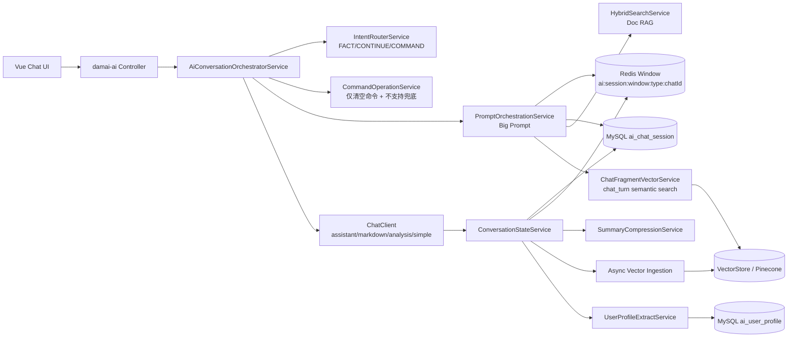
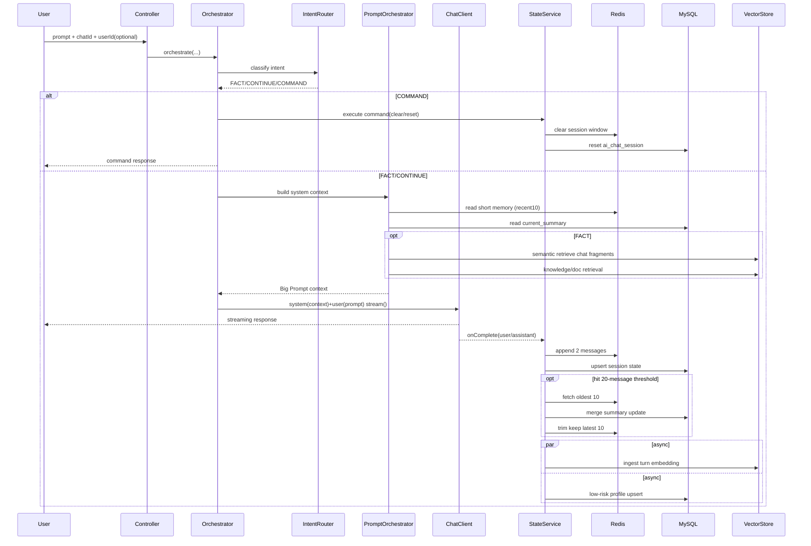

# AI 上下文优化 V1 完成态架构与流程（无 Token / 无审计）

## 1) 完成态架构图

## 2) 单轮对话流程图

## 3) 关键设计要点
- 采用“意图调度 + 分层检索”，避免每轮无差别堆上下文。
- 采用“累计20条触发压缩，最老10条合并摘要，窗口保留最新10条”策略。
- 短时记忆固定 `recent10`，不引入 Token 计算和 Token 裁剪。
- 画像仅保留低风险异步抽取骨架，不阻塞主链路。
