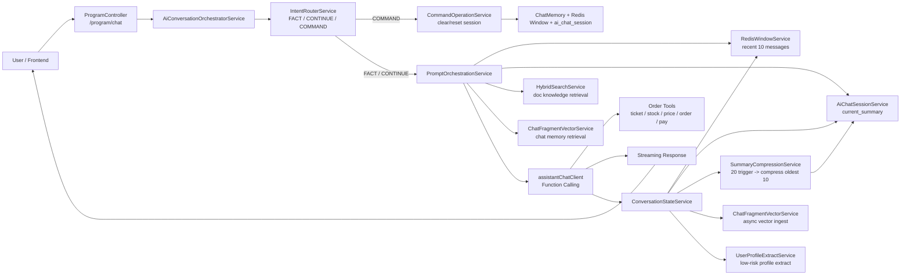
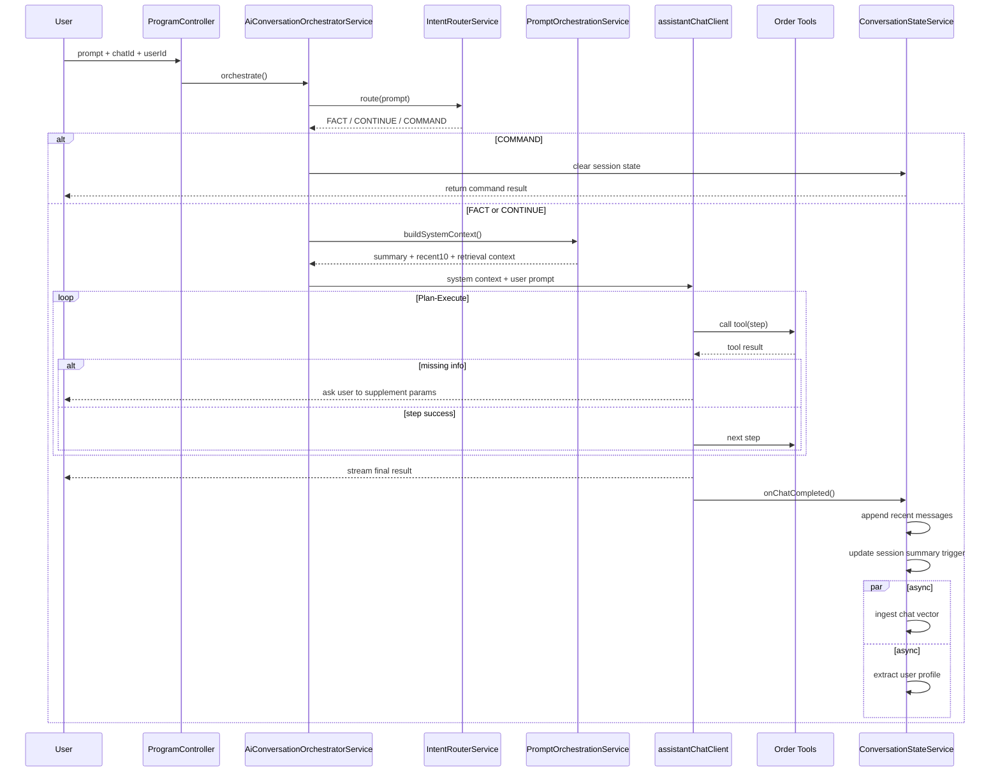
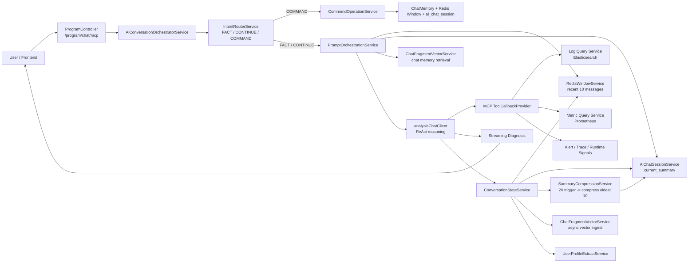
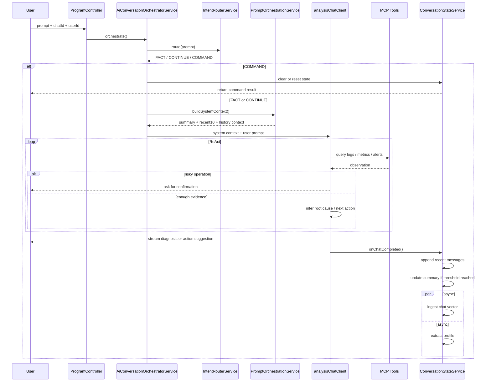

# AI 智能购票与 AI 运维架构/流程图

本文档基于当前项目中的真实组件整理，重点体现两条主链路：
- AI 智能购票：以 `Plan-Execute + Function Calling` 为主
- AI 运维：以 `ReAct + MCP Tool Calling` 为主

## AI 智能购票架构图

## AI 智能购票流程图

## AI 运维架构图

## AI 运维流程图

## 说明

- 两条链路共用统一编排入口：`ProgramController -> AiConversationOrchestratorService`
- 购票链路更强调“先拆步骤再执行”，因此主模型侧更适合 `Plan-Execute`
- 运维链路更强调“边查边判断”，因此主模型侧更适合 `ReAct`
- 两条链路都复用了当前上下文优化能力：意图路由、最近 10 条窗口、会话摘要、聊天片段向量检索、摘要压缩、异步画像提取
